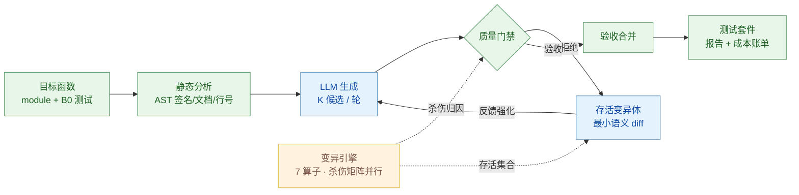
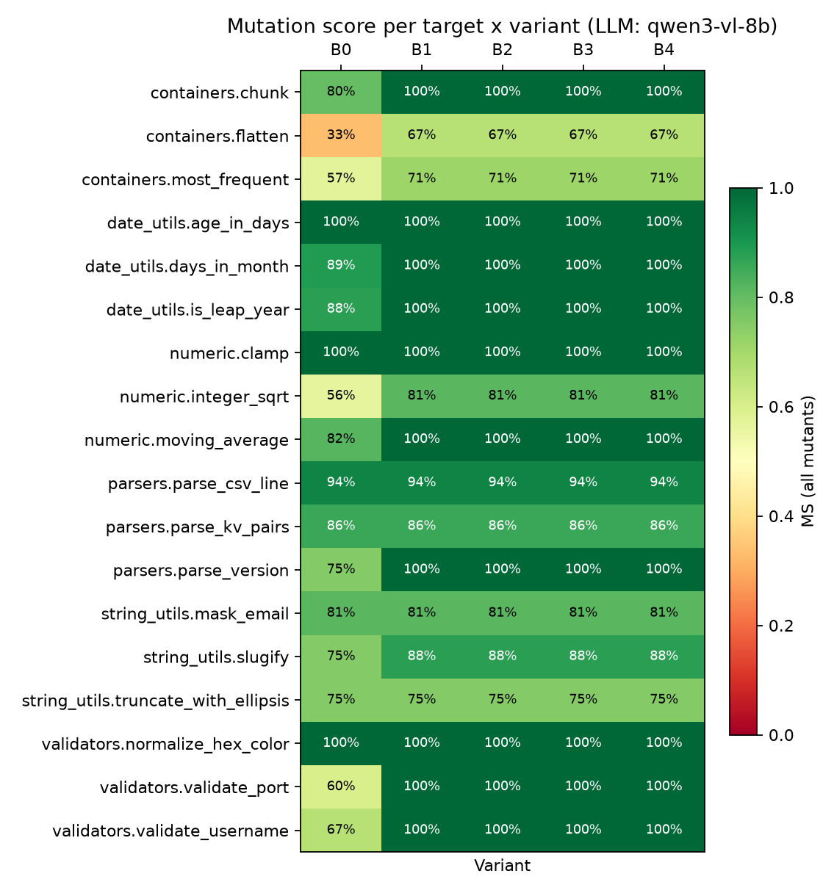
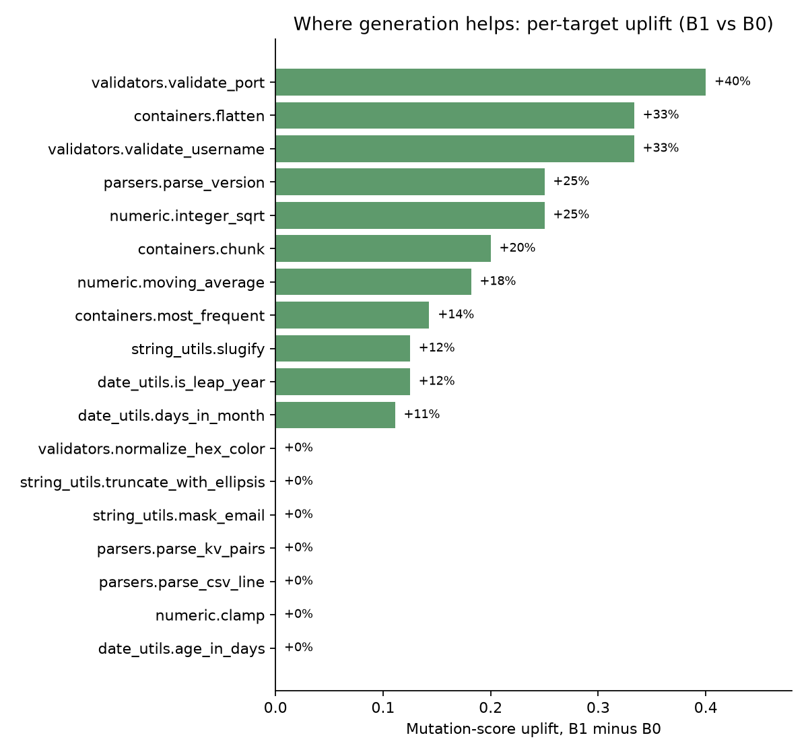
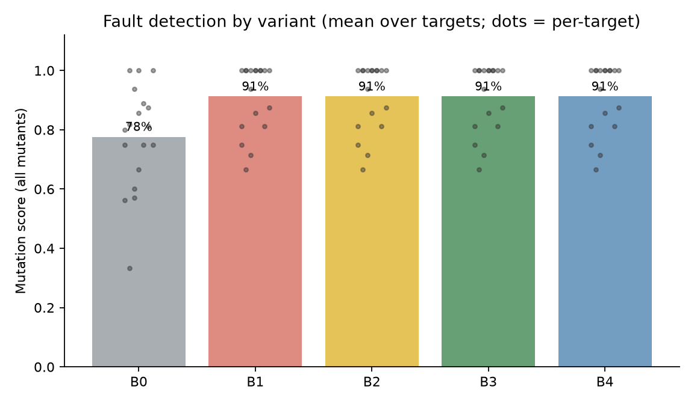

# TestForge

**以变异测试为验收标准的测试生成智能体：LLM 生成的单元测试必须被证明具备故障检出能力，才会被采纳进测试套件。**

*TestForge: a mutation-guided test quality agent. LLM-generated unit tests are accepted only if they provably kill seeded faults that the existing suite misses.*


## 快速上手

以下命令在 Windows（`.venv/Scripts`）与 Linux/macOS（`.venv/bin`）上等价，均从仓库根目录执行。

**第 1 步：环境（约 1 分钟）**

```bash
python -m venv .venv
.venv/Scripts/pip install pytest coverage openai matplotlib
```

**第 2 步：跑通一个目标（约 1 分钟，离线 Mock 后端，无任何网络与 API 依赖）**

```bash
.venv/Scripts/python -m testforge.cli run --target numeric.integer_sqrt --variant B3 --mode mock
```

真实输出示例（各字段含义见下）：

```text
numeric.integer_sqrt                     B3  MS(all)= 76.2%  MS(cov)= 76.2%  gen=8   acc=2        80s
```

`MS(all)` 为最终测试套件的变异分数；`gen`/`acc` 为生成与通过门禁验收的候选测试数。

**第 3 步：查看产物**。运行后在 `results/runs/` 下生成 JSON 结果，可用 `report` 子命令渲染为 Markdown 报告；仓库内也提交了一份真实模型运行的完整报告样例：[docs/example-report.md](docs/example-report.md)。

**第 4 步：在自己的代码上运行**（详见[下文](#在自己的代码上运行)）。

**第 5 步：完整实验网格与统计报告**——配置好 LLM 端点后：

```bash
.venv/Scripts/python experiments/run_experiment.py --mode api     # 18 目标 × 5 变体
.venv/Scripts/python experiments/analyze.py --exp results/exp_api_full
.venv/Scripts/python experiments/plots.py   --exp results/exp_api_full
```

## 1. 问题背景

LLM 编程助手生成的单元测试存在系统性的**弱预言机（weak oracle）**问题：测试针对当前代码编写，倾向于通过而非证伪，断言薄弱、边界缺失。行覆盖率因此成为一个误导性的质量代理——一条 `assert result is not None` 即可覆盖分支而不校验任何行为。测试通过只能说明测试与代码相互一致，不能说明代码正确。

工业界的数据与动作支持这一判断：

- 66% 的企业用户将"几乎正确但差一点"列为 AI 编码工具的首要痛点（Kilo 2026 Buyer's Guide）；AI 辅助代码伴随更高的评审返工率与回滚率（Glean，2026）。
- Meta 在 FSE 2025 发表 ACH 系统（*Mutation-Guided LLM-based Test Generation at Meta*），以变异测试反馈驱动 LLM 生成更强的测试；学界有 MutGen（arXiv:2506.02954）、PRIMG 等后续工作。
- 上述系统均无开源、端到端、可复现的实现。TestForge 补充这一空缺，并提供了完整的实验方法论与统计评估。

变异分数（mutation score，被杀死的变异体占总变异体的比例）直接度量故障检出能力，是测试质量的经典金标准。它的主要障碍是执行成本——O(测试数 × 变异体数) 次测试运行——这也是本工程重点处理的问题。

## 2. 系统设计



**验收门禁**（全部通过才采纳一个候选测试）：

| 信号 | 判定 | 拒绝对象 |
|---|---|---|
| `runs_on_original` | 在当前代码上连续通过 N 次（默认 5） | 偶然通过的测试、由随机性/时间导致的 flaky 测试 |
| `falsifiable` | 至少杀死 1 个既有套件未杀死的变异体 | 断言空洞、不提供任何质量证据的测试 |
| `coverage_delta`（可选） | 新增覆盖行 | 默认仅报告不强制，理由见技术报告 §4.3 |

**反馈回路**：未被杀死的存活变异体以最小语义 diff 的形式回填到下一轮生成 prompt（例如 `[M008] line 17 (CRN): 'i + 1' -> 'i + 2'`）。每轮反馈等价于向模型提供其测试未能检出的具体缺陷。验收采用贪心集合覆盖：候选的增量杀伤相对"B0 ∪ 已验收集合"计算，存活集随验收收缩，直至分数平台期。

## 在自己的代码上运行

前提：目标函数所在模块为单个 `.py` 文件，文件名是合法的 Python 标识符（测试将按该名称 import）；函数为确定性纯函数（不依赖网络/时钟/随机数）；已有测试文件可选（没有则 B0 为空基线）。

```bash
.venv/Scripts/python -m testforge.cli run \
    --module path/to/your_module.py \
    --function your_function \
    --tests path/to/test_your_module.py \
    --variant B3 --mode mock          # 或 --mode api 配合 .env 中的端点
```

运行后同样得到 JSON 结果与 Markdown 报告。建议先以 `--mode mock` 验证环境与模块可导入，再切换 `--mode api` 使用真实模型。将新函数加入正式基准只需三步：在 `benchmarks/targets/` 添加模块、在 `benchmarks/existing_tests/` 添加 B0 测试、在 `benchmarks/manifest.json` 注册条目。

## 3. 实验设计

- **基准**：6 个模块 × 18 个目标函数（字符串、数值、日期、容器、解析、校验六域，参照常见开源工具库风格编写），每个目标附带刻意不完整的既有测试（B0）。变异体候选共 197 个，按算子分层采样至每目标 16 个。
- **指标**：主指标为全体变异体上的变异分数 MS(all)；辅以被覆盖变异体上的 MS(covered)、行覆盖率、候选利用率与 LLM token 计量。
- **统计方法**：目标上的变体间配对比较；Wilcoxon 符号秩检验（正态近似，含并列校正）与 bootstrap 95% 置信区间（10,000 次重采样，种子固定）；真实 LLM 后端的关键结论以两轮独立采样的网格交叉验证（见 §4.1，pooled 统计见 compare.md）。
- **公平性控制**：所有变体共用同一组变异体与同一最终联合评估器（全套件对全部变异体重跑）；两种后端使用完全相同的网格设置。

## 4. 实验结果

真实 LLM 后端完成两轮独立采样的 90 格实验网格（18 目标 × 5 变体 × 2，两轮之间清除 prompt 缓存、重新采样）；确定性 Mock 后端为种子化设计，单轮 90 格即完整定义其行为。全部实验成功、无错误。

### 4.1 真实 LLM（Qwen3-VL-8B，自建 vLLM 推理服务）

| 变体 | MS(all) 均值（网格 1） | MS(all) 均值（网格 2） | 中位数（网格 1） | 行覆盖率 | 验收测试数/目标（网格 1） |
|---|---|---|---|---|---|
| B0 | 77.6% | 77.6% | 80.6% | 83.1% | — |
| B1 | 91.3% | 89.4% | 100% | 92.6% | 1.28 |
| B2 | 91.3% | 89.4% | 100% | 92.6% | 0.61 |
| B3 | 91.3% | 90.6% | 100% | 92.6% | 0.61 |
| B4 | 91.3% | 90.6% | 100% | 92.6% | 0.61 |

| 全网格变异分数分布 | 逐目标提升（B1 − B0） | 变体均值对比 |
|---|---|---|
|  |  |  |

主要发现（完整统计见 [results/exp_api_full/analysis.md](results/exp_api_full/analysis.md)，重复网格一致性见 [results/exp_api_full/compare.md](results/exp_api_full/compare.md)）：

1. **生成显著提升故障检出**。B1 相对 B0 的配对变异分数差：网格 1 +13.6pp、网格 2 +11.8pp，pooled（n = 36）**+12.7pp**（中位 +12.5；Wilcoxon 符号秩检验 p = 0.0001；bootstrap 95% CI [8.5, 17.2]；21 正、15 零、0 负）。网格 1 有 10/18 个目标达到 100% 变异分数（validate_username 67%→100%、validate_port 60%→100%、parse_version 75%→100%、days_in_month 89%→100%、moving_average 82%→100% 等）；两轮网格均达到 100% 的目标为 8/18，其余 10 个目标（两轮并集）各残留 1–3 个存活变异体，以 CRN 常量替换为主，另有少量 RTN/CRS/AOR。
2. **门禁在不损失检出力的前提下压缩套件规模**。B1 与 B2/B3 的变异分数相同（91.3%），但 B2/B3 的验收测试数为 B1 的 53%（11 对 23）；门禁同时过滤了 12 个在原代码上即失败的候选。
3. **反馈回路的增量存在但触发率低（8B 规模）**。两轮网格 36 个 (目标, 重复) 单元中，35 个的 B3-B1 增量为零——单次生成（每轮 3 候选）已覆盖易杀变异体，剩余存活变异体集中于语义边界。唯一的非零单元是 `validate_port`：反馈轮第 2 轮产出的验收测试将变异分数从 80% 补齐至 100%。结合全强度对照运行（反馈轮产出杀死 5 个 B0 未杀死变异体的验收测试，含一个 Mock 后端无法杀死的算子变异），可以确认回路机制有效；增量触发率取决于剩余变异体的语义难度与模型能力，是后续以更大模型、更多候选与轮次验证的方向。**这条结论随后被本项目自身的后续实验部分推翻，见 §4.3。**
4. **覆盖率与检出力解耦**（Mock 网格观察，见 §4.2）：无门禁变体多验收的测试推高覆盖率 4.3 个百分点，变异分数增益为零。

LLM 消耗与门禁行为：

| 变体 | LLM 调用 | tokens in | tokens out | 不可证伪拒绝 | 原代码失败拒绝 |
|---|---|---|---|---|---|
| B1 | 15 | 17,876 | 16,841 | （无门禁） | 12 |
| B2 | 15 | 17,876 | 16,841 | 12 | 12 |
| B3 | 19 | 22,221 | 21,093 | 18 | 18 |
| B4 | 19 | 21,923 | 21,331 | 19 | 17 |

验收测试样例（`numeric.integer_sqrt`，真实模型生成，杀伤归因经杀伤矩阵核验；完整报告见 [docs/example-report.md](docs/example-report.md)）：

```python
import pytest

from numeric import integer_sqrt


def test_integer_sqrt_negative():
    with pytest.raises(ValueError, match="n must be non-negative"):
        integer_sqrt(-1)


def test_integer_sqrt_zero():
    assert integer_sqrt(0) == 0


def test_integer_sqrt_one():
    assert integer_sqrt(1) == 1


def test_integer_sqrt_small_positive():
    assert integer_sqrt(2) == 1
    assert integer_sqrt(3) == 1
    assert integer_sqrt(4) == 2


def test_integer_sqrt_large_perfect_square():
    assert integer_sqrt(100) == 10
    assert integer_sqrt(10000) == 100


def test_integer_sqrt_large_non_perfect_square():
    assert integer_sqrt(99) == 9
    assert integer_sqrt(1000) == 31
    assert integer_sqrt(1000000) == 1000
```

其中 `integer_sqrt(0) == 0` 检出 `n < 0` 的 `0 → 1` 变异与 `return n → None` 变异；`integer_sqrt(2) == 1` 检出 `n < 2` 的 `2 → 3`；`integer_sqrt(3) == 1` 检出二分初始化的 `lo = 1 → 2`；`integer_sqrt(4) == 2` 检出 `n // 2 + 1` 的 `+ → -`。该目标变异分数由 56% 升至 81%。

### 4.2 确定性 Mock 后端（机制验证）

Mock 后端是捕获-重放式特征化测试生成器：执行目标函数并将观测到的输出与异常冻结为断言。它能够杀死值/算子类的变异体，但无法构造需要语义理解的预言机，因此适合用于验证门禁与回路机制而非度量生成质量。该网格中 B1 相对 B0 提升 +7.8 个百分点（p = 0.0076，CI [4.0, 11.8]）；语义型存活变异体对应的所有候选被门禁以可证伪性标准拒绝（53 次），覆盖率提升 4.3 个百分点而变异分数增益为零——印证覆盖率不是质量的主导度量。完整分析见 [results/exp_mock_full/analysis.md](results/exp_mock_full/analysis.md)。

### 4.3 后续实验：取消早退规则后的反馈回路增量（B5）

§4.1 第 3 条留下一个待检验的可能：低触发率究竟是回路本身没用，还是"B3 一轮零验收即停止迭代"这条**工程早退规则**把反馈机会掐断了？为此新增变体 **B5**——门禁与变异反馈设置与 B3 完全相同，唯一差别是零验收轮不提前终止，把轮次预算（4 轮）走完。B3 的定义与两轮已发表网格保持不变，因此构成干净的定点消融。

| 网格 | 目标 | 变异体/目标 | B0 | B2 单轮+门禁 | B5 走完 4 轮 | B5 − B2 配对增量 |
|---|---|---|---|---|---|---|
| 困难子集 · 采样 1 | 10（残留存活体） | 24 | 68.2% | 82.3% | 88.9% | +6.7pp（3 胜 7 平 0 负） |
| 困难子集 · 采样 2（清缓存独立重采） | 10 | 24 | 68.2% | 83.9% | 91.1% | +7.1pp（3 胜 7 平 0 负） |
| **两采样 pooled** | 10 × 2 | 24 | — | — | — | **+6.9pp；6 胜 14 平 0 负；Wilcoxon p=0.027；95% CI [+2.4, +12.1]pp** |
| 全基准 | 18 | 24 | 77.2% | 89.2% | **93.8%** | +4.7pp（4 胜 14 平 0 负；p=0.068；CI [+1.0, +9.4]pp） |

主要结论：

1. **增量真实存在且可复现**：两次独立采样的均值增量相差仅 0.4pp，pooled 后达到显著水平（p=0.027），且全部 38 个配对单元（20 + 18）**无一例退步**。
2. **胜出全部来自反馈轮**：全基准上四个胜出目标的验收测试分别出自第 2、2、3、3–4 轮——即 B3 的早退规则永远无法到达的轮次。`string_utils.mask_email` 在第 3 轮由单个测试杀死 4 个变异体，把 76.2% 提到 95.2%（第二次采样提到 100%）；该目标在两轮已发表网格里始终卡在 81.2%。
3. **代价可量化**：全基准上 B5 相对 B2 使用 2.5 倍 LLM 调用（38 对 15）与 3.1 倍输出 token（51,898 对 16,711），换 +4.7pp；14/18 个目标零增量，增量集中在难目标上。
4. **口径限定**：本网格变异体上限为 24/目标，而 §4.1 的网格为 16/目标，**绝对分数不可跨表横比**，可比的是同一网格内的 B5 − B2 配对；全基准网格中 10 个困难目标命中上一采样的 prompt 缓存（重放），因此它只新增 8 个易目标的信息，不构成第三个独立样本。产物见 `results/exp_api_rq2b/`、`results/exp_api_rq2rep/`、`results/exp_api_rq2full/`（前两者的跨网格检验见 `results/exp_api_rq2b/compare.md`）。

## 5. 工程实现要点

- **杀伤矩阵执行**：O(测试 × 变异体) 次运行通过进程池并行、`pytest -x` 首败即停、仅对存活变异体执行候选测试三项措施控制成本；超时按惯例计为杀死（可观测的行为改变）。
- **成本控制**：单次响应携带 K 个候选；prompt 磁盘缓存使重跑零 API 消耗；token 逐笔记账；变异体按算子分层采样设上限。
- **可复现性**：变异采样与 Mock 采样全部使用显式种子（crc32，规避 `PYTHONHASHSEED` 随机化）；LLM 响应落盘缓存；实验网格逐格落盘，中断后可续跑。
- **自身质量**：36 个单元/集成测试覆盖变异算子、源码拼接、门禁判定、Mock 确定性、杀伤矩阵、早退/续跑语义与端到端管线，由 CI 在 ubuntu（3.10/3.11/3.12）与 windows（3.12）矩阵上验证。

## 6. 局限

- 等价变异体无法完全排除，变异分数是下界估计；已通过跳过错误消息字符串、docstring 与注解压缩近等价变异体。
- 基准为 18 个纯函数、单一语言（Python），结论外推到大型仓库与其他语言需进一步验证。
- 真实 LLM 网格每轮为独立单次采样，方差通过重复网格报告；多 seed 的系统性重复留待后续。
- 效果结论来自 8B 级模型；更大模型在语义型存活变异体上的行为是待验证问题。

## 7. 常见问题

**接受数为 0（acc=0）是出错了吗？** 不是。门禁按可证伪性标准验收：若既有测试已较强、或候选未产生新的杀伤，全部候选都会被拒绝（示例见 [docs/example-report.md](docs/example-report.md) 的 Gate rejections 表）。这表示"模型没有提供可证明的增量"，而非流程失败。

**LLM 输出没有按 CANDIDATE 标记分段、或大量候选被拒？** 较小的模型对输出格式的遵循度较差；语法与导入错误会在正确性检查中被过滤。可尝试降低 `temperature`、提高 `max_tokens`（配置项见 `testforge/config.py`），或更换更强的模型。

**Windows 控制台中文乱码？** 设置环境变量 `PYTHONUTF8=1`。

**`pip install -e .` 失败？** 项目路径含非 ASCII 字符时 setuptools 可编辑安装存在已知问题；本项目从仓库根目录运行即可，无需安装。

**重复运行实验会得到相同结果吗？** prompt 缓存（`llm_cache/`）命中时逐位一致——这可用于验证评估管线的确定性；清除缓存后重新运行 `--mode api`，真实 LLM 后端将产生独立采样的新网格，而 Mock 后端因种子化设计始终一致。

**如何接入新的 LLM 服务？** 任意 OpenAI 兼容端点只需 `.env` 中四个变量（见 `.env.example`）；`TESTFORGE_EXTRA_BODY` 可透传服务端专属参数（如 Qwen3 的 `enable_thinking`）。

## 8. 目录结构

```
testforge/
├── testforge/                 # 主包
│   ├── analysis/inspector.py  #   AST 静态分析：签名/注解/文档/行号区间
│   ├── llm/client.py          #   OpenAI 兼容客户端 + 确定性 Mock；缓存/重试/记账
│   ├── mutation/operators.py  #   7 类 AST 变异算子（AOR/ROR/BCR/CRN/CRS/UOR/RTN）
│   ├── mutation/engine.py     #   变异体生成：源码拼接/校验/分层采样
│   ├── mutation/runner.py     #   杀伤矩阵执行：进程池并行 + pytest -x 提前退出
│   ├── gate/gate.py           #   质量门禁：正确性/flaky/可证伪/覆盖率增量
│   ├── gate/runner.py         #   子进程测试执行 + coverage 精确测量
│   ├── agent/orchestrator.py  #   编排器：生成→门禁→反馈→验收→联合评估
│   ├── agent/prompts.py       #   结构化 Prompt（初始 + 变异反馈 + 修复）
│   ├── report/renderer.py     #   Markdown 报告
│   └── cli.py                 #   命令行入口
├── benchmarks/                # 6 模块 × 18 目标函数 + B0 既有测试
├── experiments/               # 实验网格 / 统计分析 / 图表 / 跨网格比较
├── results/                   # 实验产物（结果、分析、图表）
├── tests/                     # 自身测试（36 个）
└── docs/                      # 技术报告与示例报告
```

## 9. 引用

- Meta, *Mutation-Guided LLM-based Test Generation at Meta*（ACH）, FSE 2025
- MutGen: *Mutation-Guided Unit Test Generation with a Large Language Model*, arXiv:2506.02954
- PRIMG: *Efficient LLM-driven Test Generation Using Mutant Prioritization*, 2025
- Meta, *TestGen-LLM: Automatically Improving Unit Tests using Large Language Models*, FSE 2024
- DeMillo & Offutt, *Constraint-Based Automatic Test Data Generation*, 1991（变异测试理论基础）

行业数据：Kilo 2026 Buyer's Guide；Glean 企业 AI 效能报告（2026）。

## License

MIT
