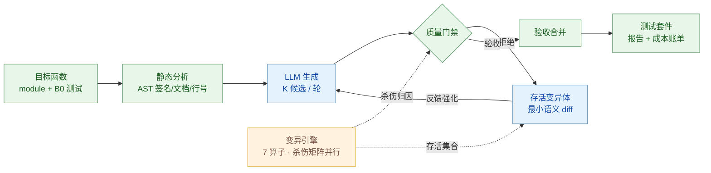

# TestForge

**以变异测试为验收标准的测试生成智能体：LLM 生成的单元测试必须被证明具备故障检出能力，才会被采纳进测试套件。**

*TestForge: a mutation-guided test quality agent. LLM-generated unit tests are accepted only if they provably kill seeded faults that the existing suite misses.*


## 1. 问题背景

LLM 编程助手生成的单元测试存在系统性的**弱预言机（weak oracle）**问题：测试针对当前代码编写，倾向于通过而非证伪，断言薄弱、边界缺失。行覆盖率因此成为一个误导性的质量代理——一条 `assert result is not None` 即可覆盖分支而不校验任何行为。测试通过只能说明测试与代码相互一致，不能说明代码正确。

工业界的数据与动作印证了该问题的严重性：

- 66% 的企业用户将"几乎正确但差一点"列为 AI 编码工具的首要痛点（Kilo 2026 Buyer's Guide）；AI 辅助代码伴随更高的评审返工率与回滚率（Glean，2026）。
- Meta 在 FSE 2025 发表 ACH 系统（*Mutation-Guided LLM-based Test Generation at Meta*），以变异测试反馈驱动 LLM 生成更强的测试；学界有 MutGen（arXiv:2506.02954）、PRIMG 等后续工作。
- 上述系统均未开源、端到端、可复现的实现。TestForge 补充这一空缺，并提供了完整的实验方法论与统计评估。

变异分数（mutation score，被杀死的变异体占总变异体的比例）直接度量故障检出能力，是测试质量的经典金标准。它的主要障碍是执行成本——O(测试数 × 变异体数) 次测试运行——这也是本工程重点处理的问题。

## 2. 系统设计



**验收门禁**（全部通过才采纳一个候选测试）：

| 信号 | 判定 | 拒绝对象 |
|---|---|---|
| `runs_on_original` | 在当前代码上连续通过 N 次（默认 5） | 偶然通过的测试、由随机性/时间导致的 flaky 测试 |
| `falsifiable` | 至少杀死 1 个既有套件未杀死的变异体 | 断言空洞、不提供任何质量证据的测试 |
| `coverage_delta`（可选） | 新增覆盖行 | 默认仅报告不强制，理由见技术报告 §4.3 |

**反馈回路**：未被杀死的存活变异体以最小语义 diff 的形式回填到下一轮生成 prompt（例如 `[M008] line 17 (CRN): 'i + 1' -> 'i + 2'`）。每轮反馈等价于向模型提供其测试未能检出的具体缺陷。验收采用贪心集合覆盖：候选的增量杀伤相对"B0 ∪ 已验收集合"计算，存活集随验收收缩，直至分数平台期。

## 3. 安装与使用

```bash
# 环境：Python ≥ 3.10，从仓库根目录运行（无需安装）
python -m venv .venv
.venv/Scripts/pip install pytest coverage openai matplotlib   # Linux/macOS: .venv/bin/pip

# 查看 18 个基准目标
python -m testforge.cli targets

# 单目标运行（离线 Mock 后端，零 API 成本）
python -m testforge.cli run --target parsers.parse_csv_line --variant B3 --mode mock
python -m testforge.cli report --results results/runs/parsers.parse_csv_line__B3.json --out report.md

# 真实 LLM：在 .env 中配置任意 OpenAI 兼容端点（DeepSeek、自建 vLLM、Ollama、one-api 等）
cp .env.example .env
python experiments/run_experiment.py --mode api      # 全网格：18 目标 × 5 变体
python experiments/analyze.py --exp results/exp_api_<stamp>
python experiments/plots.py   --exp results/exp_api_<stamp>

# 测试套件（35 个）
python -m pytest tests/ -q
```

自定义端点只需四个环境变量（详见 `.env.example`）：`DEEPSEEK_API_KEY`（无鉴权服务填任意非空串）、`TESTFORGE_API_BASE`、`TESTFORGE_MODEL`、`TESTFORGE_EXTRA_BODY`（可选的请求体扩展字段，如 Qwen3 的思考模式开关）。

实验变体：

| 变体 | 生成 | 门禁 | 反馈回路 | 研究问题 |
|---|---|---|---|---|
| B0 | — | — | — | 既有测试套件基线 |
| B1 | 单次 | 无 | 无 | 无门禁生成基线（近似直接采纳模型输出） |
| B2 | 单次 | 有 | 无 | 门禁的独立贡献 |
| B3 | 多轮 | 有 | 存活变异体 diff | 完整方案 |
| B4 | 多轮 | 有 | 覆盖缺口 | 消融：以覆盖信息替代变异体信息 |

## 4. 实验设计

- **基准**：6 个模块 × 18 个目标函数（字符串、数值、日期、容器、解析、校验六域，参照常见开源工具库风格编写），每个目标附带刻意不完整的既有测试（B0）。变异体候选共 197 个，按算子分层采样至每目标 16 个。
- **指标**：主指标为全体变异体上的变异分数 MS(all)；辅以被覆盖变异体上的 MS(covered)、行覆盖率、候选利用率与 LLM token 计量。
- **统计方法**：18 个目标上的变体间配对比较；Wilcoxon 符号秩检验（正态近似，含并列校正）与 bootstrap 95% 置信区间（10,000 次重采样，种子固定）。
- **公平性控制**：所有变体共用同一组变异体与同一最终联合评估器（全套件对全部变异体重跑）；两种后端使用完全相同的网格设置。

## 5. 实验结果

两个后端各完成 90 个实验格（18 目标 × 5 变体），全部成功、无错误。

### 5.1 真实 LLM（Qwen3-VL-8B，自建 vLLM 推理服务）

| 变体 | MS(all) 均值 | 中位数 | 行覆盖率 | 验收测试数/目标 |
|---|---|---|---|---|
| B0 | 77.6% | 80.6% | 83.1% | — |
| B1 | 91.3% | 100% | 92.6% | 1.28 |
| B2 | 91.3% | 100% | 92.6% | 0.61 |
| B3 | 91.3% | 100% | 92.6% | 0.61 |
| B4 | 91.3% | 100% | 92.6% | 0.61 |

| 全网格变异分数分布 | 变体均值对比 |
|---|---|
|  |  |

主要发现（完整统计见 [results/exp_api_full/analysis.md](results/exp_api_full/analysis.md)）：

1. **生成显著提升故障检出**。B1 相对 B0 的配对变异分数差为 +13.6 个百分点（中位 +12.5；Wilcoxon 符号秩检验 p = 0.0033；bootstrap 95% CI [7.8, 19.7]；n = 18 中 11 正、7 零、0 负）。10/18 个目标达到 100% 变异分数。
2. **门禁在不损失检出力的前提下压缩套件规模**。B1 与 B2/B3 的变异分数相同（91.3%），但 B2/B3 的验收测试数为 B1 的 53%（11 对 23）；门禁同时过滤了 12 个在原代码上即失败的候选。
3. **反馈回路在 8B 规模上的增量为本实验设计所限**。单次生成（每轮 3 候选）已覆盖易杀变异体，剩余存活变异体集中于语义边界（如 CSV 引号转义的收尾边界）。全强度对照运行（24 变异体、每轮 4 候选）中，反馈轮产出的验收测试杀死了 5 个 B0 未杀死的变异体（含一个 Mock 后端无法杀死的算子变异），表明回路机制有效；增量收益取决于剩余变异体的语义难度与模型能力，是后续实验（更大模型、更多候选与轮次）的明确方向。
4. **覆盖率与检出力解耦**（Mock 网格观察，见 §5.2）：无门禁变体多验收的测试推高覆盖率 4.3 个百分点，变异分数增益为零。

验收测试样例（`numeric.integer_sqrt`，真实模型生成，杀伤归因经杀伤矩阵核验）：

```python
import pytest

from numeric import integer_sqrt


def test_integer_sqrt_negative():
    with pytest.raises(ValueError, match="n must be non-negative"):
        integer_sqrt(-1)


def test_integer_sqrt_zero():
    assert integer_sqrt(0) == 0


def test_integer_sqrt_one():
    assert integer_sqrt(1) == 1


def test_integer_sqrt_small_positive():
    assert integer_sqrt(2) == 1
    assert integer_sqrt(3) == 1
    assert integer_sqrt(4) == 2


def test_integer_sqrt_large_perfect_square():
    assert integer_sqrt(100) == 10
    assert integer_sqrt(10000) == 100


def test_integer_sqrt_large_non_perfect_square():
    assert integer_sqrt(99) == 9
    assert integer_sqrt(1000) == 31
    assert integer_sqrt(1000000) == 1000
```

其中 `integer_sqrt(0) == 0` 检出 `n < 0` 的 `0 → 1` 变异与 `return n → None` 变异；`integer_sqrt(2) == 1` 检出 `n < 2` 的 `2 → 3`；`integer_sqrt(3) == 1` 检出二分初始化的 `lo = 1 → 2`；`integer_sqrt(4) == 2` 检出 `n // 2 + 1` 的 `+ → -`。该目标变异分数由 56% 升至 81%。

### 5.2 确定性 Mock 后端（机制验证）

Mock 后端是捕获-重放式特征化测试生成器：执行目标函数并将观测到的输出与异常冻结为断言。它能够杀死值/算子类的变异体，但无法构造需要语义理解的预言机，因此适合用于验证门禁与回路机制而非度量生成质量。该网格中 B1 相对 B0 提升 +7.8 个百分点（p = 0.0076，CI [4.0, 11.8]）；语义型存活变异体对应的所有候选被门禁以可证伪性标准拒绝（53 次），覆盖率提升 4.3 个百分点而变异分数增益为零——印证覆盖率不是质量的主导度量。完整分析见 [results/exp_mock_full/analysis.md](results/exp_mock_full/analysis.md)。

### 5.3 运行成本

真实 LLM 全网格共 68 次 LLM 调用，token 计量 79,896 输入 / 76,106 输出（逐笔记录于结果账目）；费用取决于所配置端点的单价。变异执行为本地进程池并行计算。

## 6. 工程实现要点

- **杀伤矩阵执行**：O(测试 × 变异体) 次运行通过进程池并行、`pytest -x` 首败即停、仅对存活变异体执行候选测试三项措施控制成本；超时按惯例计为杀死（可观测的行为改变）。
- **成本控制**：单次响应携带 K 个候选；prompt 磁盘缓存使重跑零 API 消耗；token 逐笔记账；变异体按算子分层采样设上限。
- **可复现性**：变异采样与 Mock 采样全部使用显式种子（crc32，规避 `PYTHONHASHSEED` 随机化）；LLM 响应落盘缓存；实验网格逐格落盘，中断后可续跑。
- **自身质量**：35 个单元/集成测试覆盖变异算子、源码拼接、门禁判定、Mock 确定性、杀伤矩阵与端到端管线，由 CI 在 ubuntu（3.10/3.11/3.12）与 windows（3.12）矩阵上验证。

## 7. 局限

- 等价变异体无法完全排除，变异分数是下界估计；已通过跳过错误消息字符串、docstring 与注解压缩近等价变异体。
- 基准为 18 个纯函数、单一语言（Python），结论外推到大型仓库与其他语言需进一步验证。
- 真实 LLM 网格为单种子运行，未报告方差；多 seed 重复的边际成本主要为本地变异执行时间。
- 效果结论来自 8B 级模型；更大模型在语义型存活变异体上的行为是待验证问题。

## 8. 目录结构

```
testforge/
├── testforge/                 # 主包
│   ├── analysis/inspector.py  #   AST 静态分析：签名/注解/文档/行号区间
│   ├── llm/client.py          #   OpenAI 兼容客户端 + 确定性 Mock；缓存/重试/记账
│   ├── mutation/operators.py  #   7 类 AST 变异算子（AOR/ROR/BCR/CRN/CRS/UOR/RTN）
│   ├── mutation/engine.py     #   变异体生成：源码拼接/校验/分层采样
│   ├── mutation/runner.py     #   杀伤矩阵执行：进程池并行 + pytest -x 提前退出
│   ├── gate/gate.py           #   质量门禁：正确性/flaky/可证伪/覆盖率增量
│   ├── gate/runner.py         #   子进程测试执行 + coverage 精确测量
│   ├── agent/orchestrator.py  #   编排器：生成→门禁→反馈→验收→联合评估
│   ├── agent/prompts.py       #   结构化 Prompt（初始 + 变异反馈 + 修复）
│   ├── report/renderer.py     #   Markdown 报告
│   └── cli.py                 #   命令行入口
├── benchmarks/                # 6 模块 × 18 目标函数 + B0 既有测试
├── experiments/               # 实验网格 / 统计分析 / 图表
├── results/                   # 实验产物（结果、分析、图表）
├── tests/                     # 自身测试（35 个）
└── docs/report.md             # 技术报告（设计/实验/有效性威胁）
```

## 9. 引用

- Meta, *Mutation-Guided LLM-based Test Generation at Meta*（ACH）, FSE 2025
- MutGen: *Mutation-Guided Unit Test Generation with a Large Language Model*, arXiv:2506.02954
- PRIMG: *Efficient LLM-driven Test Generation Using Mutant Prioritization*, 2025
- Meta, *TestGen-LLM: Automatically Improving Unit Tests using Large Language Models*, FSE 2024
- DeMillo & Offutt, *Constraint-Based Automatic Test Data Generation*, 1991（变异测试理论基础）

行业数据：Kilo 2026 Buyer's Guide；Glean 企业 AI 效能报告（2026）。

## License

MIT
