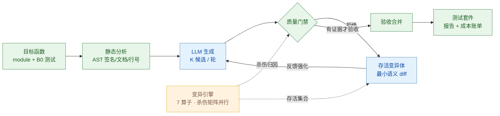

# TestForge — 变异测试引导的 AI 测试质量智能体


**LLM 生成的单元测试"能通过"，不等于"能抓住 Bug"。TestForge 用变异测试（mutation testing）作为验收标准，构建了一个生成→门禁→反馈→验收的闭环智能体，让 AI 测试的质量变得可证明、可量化、可审计。**

> *Generated tests that pass are not tests that catch bugs. TestForge is an agent loop that only accepts AI-written tests that provably kill seeded faults — an open-source reproduction and extension of Meta's ACH (FSE 2025).*

> 面向面试的完整工程项目：真实工业痛点 + 顶会论文背书（Meta ACH, FSE 2025）+ 可复现实验 + 严格统计检验。
> 技术报告见 [docs/report.md](docs/report.md)，面试准备手册见 [docs/interview.md](docs/interview.md)。

---

## 1. 问题：AI 生成的测试为什么不可信

2026 年，AI 编程助手最大的痛点已经从"能不能写代码"变成"**产出看似正确但实际不可信**"：

- 66% 的企业用户反映 AI 代码"几乎对但差一点"（[Kilo 2026 Buyer's Guide](https://kilo.ai)），AI 辅助代码的评审返工率显著上升（[Glean](https://www.glean.com)）；
- 在测试生成场景，这个问题更隐蔽：LLM 针对当前代码写测试，生成的测试**天然倾向于通过**——断言薄弱、边界缺失、只覆盖执行路径不校验行为。行覆盖率好看，但测试杀死不了任何被植入的缺陷（mutant）；
- **"测试通过"验证的是代码与测试互相一致，而不是代码正确。** 没有故障检出能力（fault detection capability）度量的测试生成，是在优化一个错误的代理指标。

工业界已经行动：Meta 在 FSE 2025 发表 [ACH 系统](https://arxiv.org/abs/2506.02954)（*Mutation-Guided LLM-based Test Generation at Meta*），用变异测试反馈驱动 LLM 生成更强的测试；学界有 MutGen（arXiv 2025）、PRIMG、MuTAP 等后续工作。**但目前没有开源、端到端、带严格评估的完整实现。** TestForge 补上这一环。

## 2. 方案：把"质量"做成门禁，把"漏洞"变成反馈



**质量门禁（全过才验收）**

| 信号 | 含义 | 拒绝什么样的测试 |
|---|---|---|
| `runs_on_original` | 在当前代码上重复通过 N 次 | 一次过的侥幸测试、随机器/时间导致的 flaky 测试 |
| `falsifiable` | 至少杀死 1 个"存活变异体" | 断言空洞、只跑不改的表演型测试 |
| `coverage_delta`（可选） | 新增覆盖行 | 纯重复既有覆盖的测试（默认仅报告不强制，见报告 §4.3） |

**变异体反馈回路**：门禁拒绝后，把"你的测试没抓到的种子缺陷"以最小 diff 形式回填给模型：

```
[M008] line 17 (CRN): `i + 1` -> `i + 2`
```

模型看到的是精确的语义变化，而不是模糊的"写得更好一点"——这是与 Meta ACH 一致的核心机制。

## 3. 快速开始

```bash
# 环境（Windows / macOS / Linux 通用，Python ≥ 3.10；从仓库根目录运行，免安装）
python -m venv .venv
.venv/Scripts/pip install pytest coverage openai matplotlib   # Linux/macOS: .venv/bin/pip
# 注：若项目路径含非 ASCII 字符，`pip install -e .` 可能因 setuptools 路径编码问题失败；
#     本项目无需安装即可运行（仓库根目录直接 python -m ...）。

# ① 离线体验全流程（Mock 模式，零 API 成本）
.venv/Scripts/python -m testforge.cli targets                     # 查看 18 个基准目标
.venv/Scripts/python -m testforge.cli run --target parsers.parse_csv_line --variant B3 --mode mock
.venv/Scripts/python -m testforge.cli report --results results/demo/parsers.parse_csv_line__B3.json --out report.md

# ② 真实 LLM 实验（DeepSeek，OpenAI 兼容接口）
cp .env.example .env        # 填入 DEEPSEEK_API_KEY
.venv/Scripts/python experiments/run_experiment.py --mode api         # 全网格：18 目标 × 5 变体
.venv/Scripts/python experiments/analyze.py --exp results/exp_api_<stamp>   # 统计检验 + RQ 分析
.venv/Scripts/python experiments/plots.py   --exp results/exp_api_<stamp>   # 图表

# ③ 任意自建 OpenAI 兼容端点（校内 vLLM / Ollama / one-api 等，无需改代码）
# 在 .env 中设置四项即可切换，例如东南大学 aicloud（需校园网可达）：
#   DEEPSEEK_API_KEY=EMPTY                                  # 无鉴权服务填任意非空串
#   TESTFORGE_API_BASE=http://aicloud.seu.edu.cn:20082/v1
#   TESTFORGE_MODEL=qwen3-vl-8b
#   TESTFORGE_EXTRA_BODY={"enable_thinking": false}         # Qwen3 关思考模式；vLLM 原生格式见 .env.example
# 注意：小模型（≤8B）格式违规率与门禁拒绝率会显著升高、变异分数提升幅度预计低于
# DeepSeek-V3 级别——这本身是"模型规模 × 反馈收益"的天然实验素材；成本列按
# DeepSeek 价格折算，免费内部端点请忽略。

# ④ TestForge 自身测试（35 个）
.venv/Scripts/python -m pytest tests/ -q
```

变体说明（实验网格的每一列）：

| 变体 | 生成 | 门禁 | 反馈回路 | 对应研究问题 |
|---|---|---|---|---|
| **B0** | — | — | — | 既有测试套件基线 |
| **B1** | 单次 | ✗ | ✗ | "氛围测试"现状（RQ1/RQ2/RQ3 基线） |
| **B2** | 单次 | ✓ | ✗ | 门禁的独立贡献（RQ3） |
| **B3** | 多轮 | ✓ | 存活变异体 diff | **完整方案（ours）**（RQ2） |
| **B4** | 多轮 | ✓ | 覆盖缺口 | 消融：反馈信号换成覆盖率（RQ4） |

## 4. 目录结构

```
testforge/
├── testforge/                 # 主包
│   ├── analysis/inspector.py  #   AST 静态分析：签名/注解/文档/行号区间
│   ├── llm/client.py          #   DeepSeek(OpenAI兼容) + 确定性 Mock 双后端；缓存/重试/记账
│   ├── mutation/operators.py  #   7 类 AST 变异算子（AOR/ROR/BCR/CRN/CRS/UOR/RTN）
│   ├── mutation/engine.py     #   变异体生成：源码拼接/校验/分层采样
│   ├── mutation/runner.py     #   杀伤矩阵执行：进程池并行 + pytest -x 提前退出
│   ├── gate/gate.py           #   质量门禁：正确性/flaky/可证伪/覆盖率增量
│   ├── gate/runner.py         #   子进程测试执行 + coverage 精确测量
│   ├── agent/orchestrator.py  #   编排器：生成→门禁→反馈→验收→联合评估
│   ├── agent/prompts.py       #   结构化 Prompt（初始 + 变异反馈 + 修复）
│   ├── report/renderer.py     #   Markdown 报告
│   └── cli.py                 #   命令行入口
├── benchmarks/                # 6 模块 × 18 目标函数 + B0 既有测试
├── experiments/               # 实验网格 / 统计分析 / 图表
├── tests/                     # TestForge 自身测试（35 个）
├── docs/report.md             # 技术报告（问题/相关工作/设计/实验/局限）
└── docs/interview.md          # 面试手册（电梯稿/STAR/追问 Q&A）
```

## 5. 工程亮点（面试讨论点）

- **杀伤矩阵的执行工程**：O(测试×变异体) 次测试执行，通过进程池并行 + `pytest -x` 首败即停 + 仅对存活变异体执行候选测试三个手段压成本；TIMEOUT 按惯例计为杀死（行为改变的观察）。
- **成本工程**：prompt 磁盘缓存（同 prompt 重跑零 API 成本）、单次响应携带 K 个候选、token/费用逐笔记账、变异体分层采样上限。
- **可复现性**：变异采样与 Mock 输入采样全部种子化（crc32 而非内置 hash，规避 PYTHONHASHSEED 随机化）；LLM 响应缓存；每格实验崩溃安全的增量落盘。
- **诚实工程**：Mock 模式是真实的"特征化测试"生成器（捕获-重放），能杀掉大量值/算子类变异体但**不会伪装**杀掉需要语义理解的变异体——门禁会诚实地拒绝它，演示了系统不是靠作弊达标。
- **测试系统本身**：35 个单元/集成测试覆盖算子、拼接、门禁、Mock 确定性、杀伤矩阵与端到端管线，由 GitHub Actions 在 ubuntu（3.10/3.11/3.12）+ windows（3.12）矩阵上持续验证，并通过 `pip install -e .` 校验打包配置。

## 6. 结果快照

### 6.1 真实 LLM 实验（Qwen3-VL-8B @ 校内 vLLM，18 目标 × 5 变体，90/90 格零错误）

| 全网格一览（18 目标 × 5 变体） | 变体均值对比 |
|---|---|
|  |  |

> 完整分析与统计检验见 [results/exp_api_full/analysis.md](results/exp_api_full/analysis.md)（Mock 网格对照见 [results/exp_mock_full/analysis.md](results/exp_mock_full/analysis.md)）。

- **RQ1 生成有效（显著）**：单次生成（B1）相对既有套件（B0）变异分数 **+13.6pp**（11 胜/7 平/**0 负**，Wilcoxon p=0.0033，bootstrap 95% CI [+7.8, +19.7]）；**10/18 个目标达到 100% 变异分数**；
- **RQ3 门禁反冗余**：B1 与 B2/B3 变异分数相同（91.3%），但验收测试数 23 → 11（**2.1× 更少**）；门禁还拦下了 8B 模型产生的 12 个"在原代码上就失败"的坏候选；
- **RQ2 诚实记录**：在本基准 + 8B 模型 + 3 候选设置下，反馈回路未带来额外变异分数（单次生成已饱和易杀变异体，剩余存活体是语义难点）；但全强度设置的对照冒烟（24 变异体、4 候选）中，反馈轮产出了杀死 **5 个** B0 杀不死变异体（含 Mock 杀不动的 `+ → -` 算子变异）的验收测试——回路机制有效，增量收益取决于剩余存活体的语义难度，报告 §6 有完整讨论；
- **成本**：全网格仅 68 次 LLM 调用、tokens 79.9k 进 / 76.1k 出（校内端点免费；按 DeepSeek 牌价折算约 $0.03）。

**验收测试长什么样**（`numeric.integer_sqrt`，真实模型生成、门禁验收、杀伤归因经杀伤矩阵核验）：

```python
import pytest

from numeric import integer_sqrt


def test_integer_sqrt_negative():
    with pytest.raises(ValueError, match="n must be non-negative"):
        integer_sqrt(-1)


def test_integer_sqrt_zero():
    assert integer_sqrt(0) == 0


def test_integer_sqrt_one():
    assert integer_sqrt(1) == 1


def test_integer_sqrt_small_positive():
    assert integer_sqrt(2) == 1
    assert integer_sqrt(3) == 1
    assert integer_sqrt(4) == 2


def test_integer_sqrt_large_perfect_square():
    assert integer_sqrt(100) == 10
    assert integer_sqrt(10000) == 100


def test_integer_sqrt_large_non_perfect_square():
    assert integer_sqrt(99) == 9
    assert integer_sqrt(1000) == 31
    assert integer_sqrt(1000000) == 1000
```

杀伤归因：`integer_sqrt(0) == 0` 抓住 `n < 0` 的 `0 → 1` 与 `return n → None`；`integer_sqrt(2) == 1` 抓住 `n < 2` 的 `2 → 3`（变异后返回 2）；`integer_sqrt(3) == 1` 抓住 `lo = 1 → 2`（变异后二分区间坍缩返回 2）；`integer_sqrt(4) == 2` 抓住 `n // 2 + 1` 的 `+ → -`。该目标变异分数 56% → 81%。

### 6.2 Mock 全网格（机制验证，90/90 格零错误）

- **生成有效**：B1 相对 B0 **+7.8pp**（9 胜/9 平/0 负，p=0.0076，CI [+4.0, +11.8]）；
- **覆盖率与检出力解耦**：Mock 冗余测试把覆盖率推高 4.3pp 却零检出增益；
- **诚实平台期**：Mock 杀不动的语义型存活变异体被门禁全部拒绝（53 次 `falsifiable`），系统不在无法证明价值时声称价值——完整分析见 [results/exp_mock_full/analysis.md](results/exp_mock_full/analysis.md)。

## 7. 引用与依据

- Meta, *Mutation-Guided LLM-based Test Generation at Meta*（ACH）, FSE 2025；Meta 工程博客 *LLMs Are the Key to Mutation Testing*（2025-09）
- MutGen: *Mutation-Guided Unit Test Generation with a Large Language Model*, arXiv:2506.02954
- PRIMG: *Efficient LLM-driven Test Generation Using Mutant Prioritization*, 2025
- Meta, *TestGen-LLM: Automatically Improving Unit Tests using Large Language Models*, FSE 2024（验收式测试增强范式）
- 行业痛点数据：Kilo 2026 Buyer's Guide；Glean 企业 AI 效能报告（2026）

## 8. License

MIT
