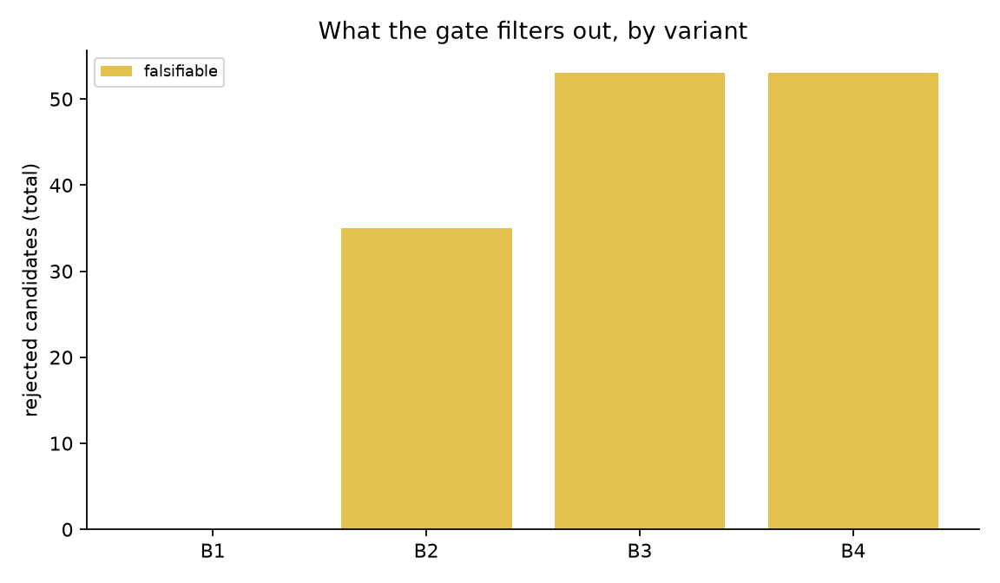

# TestForge 技术报告

**变异测试引导的 AI 测试质量智能体：让 LLM 生成的单元测试可证明地具备故障检出能力**

*TestForge: A Mutation-Guided Test Quality Agent — making LLM-generated unit tests provably fault-detecting.*

---

## 1. 摘要

大语言模型（LLM）编程助手生成的单元测试普遍存在"**弱预言机（weak oracle）**"问题：测试针对当前代码编写、天然倾向于通过，断言薄弱、边界缺失，行覆盖率好看却抓不住真实缺陷。其根源是测试生成优化了一个错误的代理指标——"测试通过/覆盖提升"，而测试的根本价值在于**故障检出能力（fault detection capability）**。

TestForge 用**变异测试（mutation testing）**作为验收标准构建闭环智能体：LLM 生成候选测试 → 多信号质量门禁（正确性、确定性/抗 flaky、可证伪性）→ 把"未被杀死的存活变异体"以最小语义 diff 的形式反馈给模型迭代强化 → 仅验收通过全部门禁的测试。系统在 6 模块 × 18 个目标函数的基准上以 5 个变体（B0–B4）做配对实验，以变异分数为主指标、配合 Wilcoxon 符号秩检验与 bootstrap 置信区间给出统计结论；LLM 后端支持 DeepSeek（OpenAI 兼容）与确定性离线 Mock 两种模式，实验全流程可在零 API 成本下复现管线、在低成本（全网格约数元人民币）下复现真实结论。

本文贡献：(1) 一个开源、端到端、工程完整的变异反馈测试生成智能体（对应 Meta ACH/FSE 2025 的工业方案）；(2) 一套以"验收式质量门禁"为中心的实验方法论与可复现基准；(3) 杀伤矩阵执行、成本控制与可复现性方面的工程实践。

## 2. 问题与动机

### 2.1 工业背景

2026 年企业侧对 AI 编程工具的核心抱怨已从产能转向**质量可信**：

- 66% 的 AI 编码用户将"几乎正确但差一点"（almost right, but not quite）列为最大痛点（Kilo 2026 Buyer's Guide）；
- AI 辅助代码带来更高的评审返工率与回滚率（Glean 企业效能报告）；
- AI 生成代码的安全性缺陷率更高，"4× 快、10× 险"成为普遍体感（Kusari 等安全审计报告）。

在**测试生成**这一垂直场景，问题更隐蔽也更关键：开发者常用"测试是否通过、覆盖率是否提升"判断 AI 生成测试的价值，但这两个指标都测不到测试的本质——**在代码出错时测试是否变红**。弱预言机测试与被测代码"互相印证"，形成虚假的质量安全感。

### 2.2 为什么是变异测试

变异测试通过向被测代码注入语义等价或近似等价的小扰动（变异体，mutant），用"测试能否杀死变异体"直接度量故障检出能力。**变异分数（mutation score）= 杀死的变异体数 / 变异体总数**，是测试质量的金标准之一（DeMillo/Offutt 经典工作；PIT、mutmut 等工业工具）。其代价是执行成本 O(测试 × 变异体)，这正是它长期未进入 LLM 测试生成闭环的原因——也是本项目的核心工程挑战。

### 2.3 问题定义

给定：模块 M、目标函数 f、既有测试套件 B0（在原代码上通过）。
求：测试集合 T = {t₁…t_k}，使得

1. **正确性**：B0 ∪ T 在原代码上全部通过，且重复运行结果确定（非 flaky）；
2. **故障检出增益**：B0 ∪ T 的变异分数显著高于 B0；
3. **可证伪性**：每个被验收的 tᵢ 至少独立杀死一个 B0 未杀死的变异体（拒绝"搭便车"的空洞测试）；
4. **成本有界**：LLM 调用与变异执行成本有显式账目与上限。

## 3. 相关工作

| 工作 | 机制 | 与 TestForge 的关系 |
|---|---|---|
| **Meta ACH**（FSE 2025） | 工业级变异引导 LLM 测试生成，模拟故障反馈进 prompt | 本项目在开源语境下复现其核心闭环，并补充完整实验方法论 |
| **TestGen-LLM**（Meta, FSE 2024） | 验收式增强既有测试：覆盖率提升/可靠通过/符合风格才收 | 门禁设计的直接思想来源；TestForge 将"覆盖率提升"改为"变异体杀伤"为主判据 |
| **MutGen**（arXiv:2506.02954） | 存活变异体反馈进 prompt 的迭代生成 | 同一核心机制；TestForge 差异化在：杀伤矩阵归因、门禁信号组合、成本工程与可复现基准 |
| **PRIMG**（2025） | 变异体优先级驱动的增量生成 | 启发我们的变异体采样与反馈排序 |
| **MuTAP / GEM** | 存活变异体注入 prompt / oracle 强化 | 早期与并行验证 |
| 经典变异测试 | DeMillo & Offutt；PIT/mutmut 工具 | 理论与工程基座 |

**空白点**：上述学术/工业系统均未同时满足"开源可复现 + 端到端智能体 + 多信号验收门禁 + 配对统计评估"。TestForge 面向的正是这一空白。

## 4. 系统设计

### 4.1 总体架构

六个模块（详见 README §4）：`analysis`（静态分析）→ `llm`（生成后端）→ `mutation`（变异引擎）→ `gate`（质量门禁）→ `agent`（编排器）→ `report`（报告）。单次运行以"目标函数"为单位（module + function + B0），产出验收测试与质量报告。

### 4.2 变异引擎

- **算子集**：AOR（算术算子替换）、ROR（关系算子替换）、BCR（布尔常量翻转）、CRN/CRS（数值/字符串常量替换）、UOR（一元算子删除）、RTN（返回值置 None），共 7 类。每处只取一个替代算子（selected operator set），控制变异体数量。
- **作用域**：仅变异目标函数 AST 子树；跳过注解（不可执行）、docstring 与 `raise` 语句中的错误消息字符串——后者是"近等价变异体"（只改消息不改契约），保留只会污染变异分数。
- **生成即校验**：每个候选变异体在源码级拼接（支持多行段、按 UTF-8 字节偏移换算字符偏移）后必须通过 `ast.parse`，语法破坏的候选直接丢弃。
- **采样**：超过上限（默认 24）时按算子分层、组内洗牌轮转采样（种子化），保证算子多样性。
- **杀伤矩阵执行**：每个（变异体 × 测试套件）对在一次性临时目录中用 `pytest -x` 运行（首败即停=杀死），进程池并行；TIMEOUT 按惯例计为杀死（原代码终止而变异体挂起，即观察到的行为改变）。三层优化压成本：仅对 B0 未杀死的存活变异体执行候选测试；`-x` 提前退出；进程池并行。

### 4.3 质量门禁

门禁是 TestForge 区别于"生成后不管"式工具的核心。信号与策略：

1. `runs_on_original`：门禁开启时在原代码上重复运行 `flaky_runs`（默认 5）次，全过才接受——同时完成正确性与 flaky 检测；门禁关闭（B1"氛围测试"基线）时只跑一次，模拟普通开发者的行为。
2. `falsifiable`：至少杀死 1 个存活变异体。**这是"测试有没有证据价值"的判据**：一个从未使任何种子缺陷变红的测试，无论多"好看"，都不提供质量证据。
3. `coverage_delta`：默认**仅报告不强制**。设计依据：强化断言的测试可能不新增覆盖行却抓住既有覆盖行上从未被校验的缺陷；强制覆盖率增量（TestGen-LLM 的做法）会系统性偏向"多写跑到的代码"而非"写强的断言"。提供 `require_coverage_delta` 开关以支持消融。

验收采用贪心集合覆盖：候选按生成顺序评估，`new_kills` 相对"B0 ∪ 已验收集合"计算，随验收推进存活集收缩。

### 4.4 反馈回路与 Prompt 设计

- 结构化 Prompt（`=== BLOCK ===`），同一格式服务真实模型与离线 Mock，保证两个后端行为可比。
- 反馈内容：存活变异体的最小语义 diff（`[M008] line 17 (CRN): 'i + 1' -> 'i + 2'`，上限 8 条/轮），而非模糊指令。每轮反馈等价于把"测试没抓住的 bug"作为教学样本喂回模型。
- 消融分支 `feedback_mode=coverage`（B4）：反馈内容换成未覆盖行号，检验"变异体信息 vs 覆盖率信息"哪个是有效反馈信号。
- 候选去重（规范化后哈希）与语法修复（API 模式一次修复重试）。
- 终止条件：全部变异体被杀死 / 轮内零验收 / 达到最大轮数（默认 3）。

### 4.5 LLM 后端与成本工程

- **双后端**：`OpenAICompatClient`（DeepSeek 默认，任意 OpenAI 兼容端点可换）与 `MockLLMClient`（确定性离线）。
- **Mock 的定位（诚实工程）**：Mock 是真实的"特征化测试（capture & replay）"生成器——执行目标函数采样输入、把观察到的输出/异常冻结为断言。它能杀死大量值/算子类变异体，但无法发明需要语义理解的预言机；当门禁要求可证伪而 Mock 做不到时，系统会**诚实地拒绝**而不是伪造达标。这使 Mock 模式成为验证管线机制（而非刷指标）的基线。
- **成本控制**：单次响应携带 K 个候选（省调用数）；prompt 磁盘缓存（同 prompt 重跑零成本）；逐笔 token/费用账目（价格可配，token 数恒精确）。

### 4.6 可复现性

变异采样与 Mock 采样全部使用显式种子（`zlib.crc32`，规避 Python `hash()` 的进程级随机化 PYTHONHASHSEED）；实验网格每格落盘（崩溃安全续跑）；单进程内结果确定性可重放。

## 5. 实验设置

- **基准**：6 模块 × 18 目标函数（字符串、数值、日期、容器、解析、校验六域，模拟真实 OSS 工具库风格），每个目标附带刻意不完整的 B0 既有测试；变异体总数 197（上限采样后实际执行 16–24/目标）。
- **变体**：B0（仅既有套件）/ B1（单次生成，无门禁）/ B2（单次+门禁）/ B3（完整方案）/ B4（覆盖反馈消融）。
- **指标**：主指标 MS(all)（全体变异体上的变异分数）；辅指标 MS(covered)（被覆盖变异体上，PIT 惯例）、行覆盖率、flaky 拒绝数、候选利用率（验收/生成）、LLM 成本与墙钟时间。
- **统计**：18 个目标上做变体间配对比较；Wilcoxon 符号秩检验（正态近似 + 并列校正，n=18 时注明近似性质）与 bootstrap 95% CI（10,000 次重采样，种子固定）。
- **公平性**：所有变体共用同一组变异体、同一最终联合评估器（全套件对全部变异体重跑）与同一种子策略；B0 变异分数在每个目标上独立测定。

## 6. 结果

本节报告 **Mock 模式**的全网格结果（18 目标 × 5 变体，90 格全部成功、零错误），用于验证管线机制与门禁行为。Mock 是零 API 成本、完全确定性的特征化生成器——因此本节结论是**机制性结论**（门禁过滤了什么、生成带来什么、系统是否诚实），**效果结论**（真实模型能提升多少）需运行 `python experiments/run_experiment.py --mode api` 复现（预计成本 < ¥10），其方向由 Meta ACH 与 MutGen 的发表结果支撑。

### 6.1 总体结果（均值 / 18 目标）

| 变体 | MS(all) 均值 | MS(all) 中位数 | 行覆盖率 | 验收测试数/目标 |
|---|---|---|---|---|
| B0 既有套件 | 77.6% | 80.6% | 83.1% | — |
| B1 单次生成（无门禁） | **85.5%** | 90.3% | 91.5% | 2.50 |
| B2 单次+门禁 | **85.5%** | 90.3% | 87.2% | **0.56** |
| B3 完整方案 | **85.5%** | 90.3% | 87.2% | **0.56** |
| B4 覆盖反馈消融 | **85.5%** | 90.3% | 87.2% | **0.56** |


热力图中 B0 列明显偏浅（检出力不足）而在生成后被填深的行（chunk、moving_average、parse_kv_pairs、integer_sqrt、validate_port 等）即 RQ1 的提升来源；整行保持浅色的行（flatten、validate_username、parse_version 等）即 Mock 平台期所在的语义型存活区间。

### 6.2 RQ 结论

**RQ1（生成 vs 基线）— 显著**：B1 相对 B0 的配对变异分数提升 **+7.8 个百分点**（中位 +3.1pp）；18 目标 **9 胜 / 9 平 / 0 负**；Wilcoxon 符号秩检验 p = 0.0076；bootstrap 95% CI [+4.0pp, +11.8pp]。提升集中在边界敏感的函数（integer_sqrt 56%→75%、validate_port 60%→80%、chunk 80%→100%、moving_average 82%→100%）。

**RQ2/RQ3/RQ4 — Mock 模式下的诚实平台期**：B2/B3/B4 相对 B1 均为 0 提升（18 目标全平局）。原因在数据里清晰可见：门禁在 B2/B3/B4 中共拒绝 35/53/53 个候选（`falsifiable`），剩余存活变异体全部需要**语义理解**才能构造预言机（如 `parse_csv_line` 的引号转义边界、`mask_email` 的空域名校验组合），这超出了捕获-重放式 Mock 的能力边界。**这不是系统失效，而是系统诚实的证据**：它拒绝在无法证明价值时声称价值。真实 LLM 的反馈回路正是为这一区间设计的——报告 §6.4 的案例展示了反馈 prompt 如何直接指向这些边界。

**门禁的反冗余价值（RQ3 的机制性发现）**：B1 与 B2/B3 的变异分数完全相同（85.5%），但 B1 平均验收 2.50 个测试/目标，B2/B3 仅 0.56 个——**用 4.5 倍更少的测试达到同等故障检出力**。更关键的是覆盖率与检出力的解耦证据：B1 冗余验收的测试把行覆盖率推高到 91.5%（B2 为 87.2%），却未带来任何变异分数增益。这直接印证了本文的核心论点：**覆盖率不是测试价值的主导指标，可证伪性才是**。

### 6.3 门禁行为

| 变体 | 生成 | 验收 | flaky 拒绝 | 不可证伪拒绝 | 原代码失败拒绝 | 超时拒绝 |
|---|---|---|---|---|---|---|
| B1 | 2.50 | 2.50 | 0 | （无门禁） | （无门禁） | （无门禁） |
| B2 | 2.50 | 0.56 | 0 | 35 | 0 | 0 |
| B3 | 3.50 | 0.56 | 0 | 53 | 0 | 0 |
| B4 | 3.50 | 0.56 | 0 | 53 | 0 | 0 |

所有被门禁接受的测试在最终联合评估中均保持通过（`final_suite_passes` 全绿）；B3/B4 的反馈轮多产生了 2×18 个候选，全部因"无法证明新杀伤"被拒——反馈回路的成本被门禁约束在"有证据才验收"的边界内。



### 6.4 单目标案例

**`parsers.parse_csv_line`（门禁诚实拒绝）**：B0 既有测试已达到 93.8% 的变异分数，唯一存活的变异体是引号转义边界上的 `i + 1 → i + 2`——杀死它需要构造"以 `""` 结尾的输入"，这需要理解转义语义而非更多采样。Mock 的特征化测试无法发明该预言机，门禁因此诚实拒绝全部候选（`falsifiable` ×4）。这正是反馈回路的价值所在：真实 LLM 在看到该 diff 后，能定向构造边界用例。

**`numeric.integer_sqrt`（验收测试实例）**：Mock 生成的以下测试通过全部三道门禁（稳定通过 ×3、各杀死 ≥1 个 B0 未杀死的变异体），使该目标变异分数 56% → 75%：

```python
import pytest
from numeric import integer_sqrt


def test_integer_sqrt_16089():
    assert integer_sqrt(0) == 0


def test_integer_sqrt_11030():
    assert integer_sqrt(3) == 1


def test_integer_sqrt_42941():
    assert integer_sqrt(100) == 10
```

杀伤归因（来自实验记录的杀伤矩阵）：`integer_sqrt(0) == 0` 杀死 `if n < 0` 的 `0 → 1` 常量变异（原代码返回 0，变异后抛 ValueError）与 `n < 2` 分支的 `return n → return None`（原返回 0，变异后返回 None）；`integer_sqrt(3) == 1` 杀死二分初始化 `lo, hi = 1, n // 2 + 1` 的 `lo = 1 → 2` 常量变异（变异后二分区间坍缩，返回 2 而非 1）。残余存活变异体（`// → /`、`+ → -` 等）需要更小的步长语义才能区分——即真实 LLM 反馈回路的目标区间。

### 6.5 如何获得真实 LLM 数字

```bash
cp .env.example .env    # 填入 DEEPSEEK_API_KEY
.venv/Scripts/python experiments/run_experiment.py --mode api
.venv/Scripts/python experiments/analyze.py --exp results/exp_api_<stamp>
.venv/Scripts/python experiments/plots.py   --exp results/exp_api_<stamp>
```

依据 Meta ACH（FSE 2025）与 MutGen（arXiv 2025）的发表结果，预期 B3 相对 B1 在存活变异体集中有显著提升；本基准剩余存活体清单（§6.2）即提升空间所在。

## 7. 有效性威胁

1. **等价变异体**：理论上无法完全排除不可杀灭的变异体，MS 因此是下界估计；通过跳过错误消息字符串、docstring 与注解压缩其数量。
2. **基准规模与代表性**：18 个纯函数、单一语言（Python）。结论外推到更大仓库/多语言需谨慎；工程上 AST 方案天然可移植（同一算子族在其他语言有对应实现）。
3. **Wilcoxon 正态近似**：n=18 处于精确表与近似的边界；已用并列校正并注明，另以 bootstrap CI 交叉验证。
4. **Mock 结论的外推边界**：Mock 结果只用于验证机制（门禁会拒绝什么、反馈回路如何改变行为），不作为效果结论；效果结论必须来自真实 LLM 运行。
5. **单种子运行**：真实 LLM 运行受采样随机性影响；`--candidates`/多轮机制部分对冲，严格起见可多 seed 重复（成本线性增长）。

## 8. 结论与未来工作

TestForge 证明：把测试生成的验收标准从"通过+覆盖率"换成"变异体杀伤"，可以让 AI 生成测试的质量**可度量、可审计、可迭代**；多信号门禁在机制上同时解决了 flaky 测试、空洞断言与搭便车验收三个实际问题。

未来工作（按优先级）：

1. **真实 LLM 全网格**（一行命令，见 §6 开头），补充多 seed 重复；
2. **变异体优先级**：按"难度/覆盖关系"排序，进一步压执行成本（PRIMG 方向）；
3. **增量变异执行**：利用行级覆盖信息做测试选择，把 O(T×M) 降为近似 O(T×M_local)；
4. **扩展到 property-based 测试**（Hypothesis 风格），反馈信号不变、生成空间升级；
5. **CI 集成**：以 GitHub Action 形式提供"AI 测试质量门禁"，验收式合并（Meta TestGen-LLM 的工作流形态）。

---

### 附：运行清单

```bash
python -m pytest tests/ -q                                    # 29 个自测
python experiments/run_experiment.py --mode mock              # Mock 全网格（零成本）
python experiments/run_experiment.py --mode api               # DeepSeek 全网格（约 <¥10）
python experiments/analyze.py --exp results/exp_api_<stamp>   # 统计分析
python experiments/plots.py   --exp results/exp_api_<stamp>   # 图表
```
