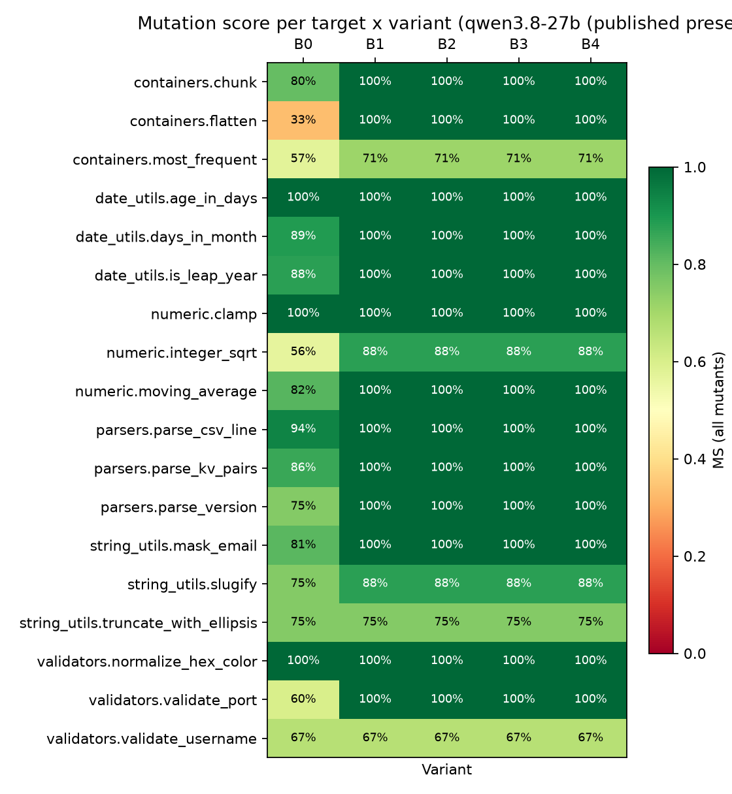

# TestForge 技术报告

**变异测试引导的 AI 测试质量智能体：让 LLM 生成的单元测试可证明地具备故障检出能力**

*TestForge: A Mutation-Guided Test Quality Agent — making LLM-generated unit tests provably fault-detecting.*

---

## 1. 摘要

大语言模型（LLM）编程助手生成的单元测试普遍存在"**弱预言机（weak oracle）**"问题：测试针对当前代码编写，倾向于通过而非证伪，断言薄弱、边界缺失，行覆盖率提升但未能校验行为。其根源是测试生成优化了一个错误的代理指标——"测试通过/覆盖提升"，而测试的根本价值在于**故障检出能力（fault detection capability）**。

TestForge 用**变异测试（mutation testing）**作为验收标准构建闭环智能体：LLM 生成候选测试 → 多信号质量门禁（正确性、确定性/抗 flaky、可证伪性）→ 把"未被杀死的存活变异体"以最小语义 diff 的形式反馈给模型迭代强化 → 仅验收通过全部门禁的测试。系统在 6 模块 × 18 个目标函数的基准上以 5 个变体（B0–B4）加 B5 消融做配对实验，**全部真实 LLM 结果统一来自单一模型**（qwen3.8-27B，SEU 校园 OpenAI 兼容网关，关闭思考模式）：主网格两轮独立采样共 180 格、B5 网格两轮共 108 格、确定性离线 Mock 90 格，**全部零错误**。主结果：单发生成将套件平均变异分数从 77.6% 提升至 93.8% / 91.2%（两采样 pooled **+14.9pp，Wilcoxon p<0.0001，25 胜 11 平 0 负**，bootstrap 95% CI [+10.4, +19.8]；满分目标 13/18 与 12/18）；门禁在检出力一分不掉的前提下把验收测试数砍至约 40–44%（1.78→0.78、1.67→0.67 个/目标）；B5 消融（取消"零验收即早退"、走满 4 轮预算）两采样 pooled **+2.9pp（p=0.0422，5 胜 31 平 0 负）**，且在第 4 轮攻克了遗留的语义硬核存活体（`parse_csv_line` 引号转义边界 95.8%→100%）；反馈回路在 2 轮 × 3 候选的已发表协议内几乎不触发（36 个配对单元 35 平），增量集中在更长轮次预算与更难目标上。模型沿革：v0.1–v0.3 曾在 Qwen3-VL-8B 上以相同协议得到方向一致的结果（pooled +12.7pp / +4.2pp），历史归档见 tag v0.3.0；自 v0.4 起本文全部结论统一由 27B 给出（§6.8）。

本文贡献：(1) 一个开源、端到端、工程完整的变异反馈测试生成智能体（对应 Meta ACH/FSE 2025 的工业方案）；(2) 一套以"验收式质量门禁"为中心的实验方法论与可复现基准；(3) 杀伤矩阵执行、成本控制与可复现性方面的工程实践。

## 2. 问题与动机

### 2.1 工业背景

2026 年企业侧对 AI 编程工具的核心抱怨已从产能转向**质量可信**：

- 66% 的 AI 编码用户将"几乎正确但差一点"（almost right, but not quite）列为最大痛点（Kilo 2026 Buyer's Guide）；
- AI 辅助代码带来更高的评审返工率与回滚率（Glean 企业效能报告）；
- AI 生成代码的安全缺陷率高于人工代码（Kusari 等安全审计报告），使评审与测试环节的重要性进一步上升。

在**测试生成**这一垂直场景，问题更隐蔽也更关键：开发者常用"测试是否通过、覆盖率是否提升"判断 AI 生成测试的价值，但这两个指标都测不到测试的本质——**在代码出错时测试是否变红**。弱预言机测试与被测代码"互相印证"，形成虚假的质量安全感。

### 2.2 为什么是变异测试

变异测试通过向被测代码注入语义等价或近似等价的小扰动（变异体，mutant），用"测试能否杀死变异体"直接度量故障检出能力。**变异分数（mutation score）= 杀死的变异体数 / 变异体总数**，是测试质量的金标准之一（DeMillo/Offutt 经典工作；PIT、mutmut 等工业工具）。其代价是执行成本 O(测试 × 变异体)，这正是它长期未进入 LLM 测试生成闭环的原因——也是本项目的核心工程挑战。

### 2.3 问题定义

给定：模块 M、目标函数 f、既有测试套件 B0（在原代码上通过）。
求：测试集合 T = {t₁…t_k}，使得

1. **正确性**：B0 ∪ T 在原代码上全部通过，且重复运行结果确定（非 flaky）；
2. **故障检出增益**：B0 ∪ T 的变异分数显著高于 B0；
3. **可证伪性**：每个被验收的 tᵢ 至少独立杀死一个 B0 未杀死的变异体（拒绝"搭便车"的空洞测试）；
4. **成本有界**：LLM 调用与变异执行成本有显式账目与上限。

## 3. 相关工作

| 工作 | 机制 | 与 TestForge 的关系 |
|---|---|---|
| **Meta ACH**（FSE 2025） | 工业级变异引导 LLM 测试生成，模拟故障反馈进 prompt | 本项目在开源语境下复现其核心闭环，并补充完整实验方法论 |
| **TestGen-LLM**（Meta, FSE 2024） | 验收式增强既有测试：覆盖率提升/可靠通过/符合风格才收 | 门禁设计的直接思想来源；TestForge 将"覆盖率提升"改为"变异体杀伤"为主判据 |
| **MutGen**（arXiv:2506.02954） | 存活变异体反馈进 prompt 的迭代生成 | 同一核心机制；TestForge 差异化在：杀伤矩阵归因、门禁信号组合、成本工程与可复现基准 |
| **PRIMG**（2025） | 变异体优先级驱动的增量生成 | 启发我们的变异体采样与反馈排序 |
| **MuTAP / GEM** | 存活变异体注入 prompt / oracle 强化 | 早期与并行验证 |
| 经典变异测试 | DeMillo & Offutt；PIT/mutmut 工具 | 理论与工程基座 |

**研究空白**：上述学术与工业系统均未同时满足"开源可复现 + 端到端智能体 + 多信号验收门禁 + 配对统计评估"。TestForge 面向这一空白。

## 4. 系统设计

### 4.1 总体架构

六个模块（详见 README §4）：`analysis`（静态分析）→ `llm`（生成后端）→ `mutation`（变异引擎）→ `gate`（质量门禁）→ `agent`（编排器）→ `report`（报告）。单次运行以"目标函数"为单位（module + function + B0），产出验收测试与质量报告。

### 4.2 变异引擎

- **算子集**：AOR（算术算子替换）、ROR（关系算子替换）、BCR（布尔常量翻转）、CRN/CRS（数值/字符串常量替换）、UOR（一元算子删除）、RTN（返回值置 None），共 7 类。每处只取一个替代算子（selected operator set），控制变异体数量。
- **作用域**：仅变异目标函数 AST 子树；跳过注解（不可执行）、docstring 与 `raise` 语句中的错误消息字符串——后者是"近等价变异体"（只改消息不改契约），保留只会污染变异分数。
- **生成即校验**：每个候选变异体在源码级拼接（支持多行段、按 UTF-8 字节偏移换算字符偏移）后必须通过 `ast.parse`，语法破坏的候选直接丢弃。
- **采样**：超过上限（默认 24）时按算子分层、组内洗牌轮转采样（种子化），保证算子多样性。
- **杀伤矩阵执行**：每个（变异体 × 测试套件）对在一次性临时目录中用 `pytest -x` 运行（首败即停=杀死），进程池并行；TIMEOUT 按惯例计为杀死（原代码终止而变异体挂起，即观察到的行为改变）。三层优化压成本：仅对 B0 未杀死的存活变异体执行候选测试；`-x` 提前退出；进程池并行。

### 4.3 质量门禁

门禁是 TestForge 区别于"生成后不管"式工具的核心。信号与策略：

1. `runs_on_original`：门禁开启时在原代码上重复运行 `flaky_runs`（默认 5）次，全部通过才接受——同时完成正确性与 flaky 检测；门禁关闭（B1 无门禁基线）时只运行一次，对应直接采纳模型输出的开发方式。
2. `falsifiable`：至少杀死 1 个存活变异体。**这是"测试有没有证据价值"的判据**：一个从未使任何种子缺陷变红的测试，无论多"好看"，都不提供质量证据。
3. `coverage_delta`：默认**仅报告不强制**。设计依据：强化断言的测试可能不新增覆盖行却抓住既有覆盖行上从未被校验的缺陷；强制覆盖率增量（TestGen-LLM 的做法）会系统性偏向"多写跑到的代码"而非"写强的断言"。提供 `require_coverage_delta` 开关以支持消融。

验收采用贪心集合覆盖：候选按生成顺序评估，`new_kills` 相对"B0 ∪ 已验收集合"计算，随验收推进存活集收缩。

### 4.4 反馈回路与 Prompt 设计

- 结构化 Prompt（`=== BLOCK ===`），同一格式服务真实模型与离线 Mock，保证两个后端行为可比。
- 反馈内容：存活变异体的最小语义 diff（`[M008] line 17 (CRN): 'i + 1' -> 'i + 2'`，上限 8 条/轮），而非模糊指令。每轮反馈等价于把"测试没抓住的 bug"作为教学样本喂回模型。
- 消融分支 `feedback_mode=coverage`（B4）：反馈内容换成未覆盖行号，检验"变异体信息 vs 覆盖率信息"哪个是有效反馈信号。
- 候选去重（规范化后哈希）与语法修复（API 模式一次修复重试）。
- 终止条件：全部变异体被杀死 / 轮内零验收 / 达到最大轮数（默认 3）。第二条是工程取舍（省成本），但它同时压制了回路的可观测增量——§6.7 的 B5 消融正是对这条规则的定点检验：B5 与 B3 唯一差别是取消"零验收即停"，把轮次预算走完。

### 4.5 LLM 后端与成本工程

- **双后端**：`OpenAICompatClient`（DeepSeek 默认，任意 OpenAI 兼容端点可换）与 `MockLLMClient`（确定性离线）。
- **Mock 的定位**：Mock 是特征化测试（capture & replay）生成器——执行目标函数采样输入、将观测到的输出/异常冻结为断言。它能够杀死大量值/算子类变异体，但无法构造需要语义理解的预言机；当可证伪性检查无法满足时，门禁将拒绝其全部候选，而非放行缺乏质量证据的测试。这使 Mock 模式成为验证管线机制的基线。
- **成本控制**：单次响应携带 K 个候选（省调用数）；prompt 磁盘缓存（同 prompt 重跑零成本，缓存键含 `extra_body` 以防跨协议串音）；逐笔 token/费用账目（价格须显式配置并带来源，token 数恒精确）。
- **受限网关适配**（0.3 起，均带测试）：`TESTFORGE_TRANSPORT=urllib` 标准库传输——部分校园网关的 WAF 会拦截 openai SDK 的 HTTP 栈而放行等价的普通请求；`TESTFORGE_MIN_CALL_INTERVAL_SEC` 调用节流与 `TESTFORGE_LLM_RETRIES` 重试预算——应对 HTTP 420 类压力限流；推理模型"思考耗尽输出预算返回空 content"时响亮报错并重试，而非静默产出零候选格。

### 4.6 可复现性

变异采样与 Mock 采样全部使用显式种子（`zlib.crc32`，规避 Python `hash()` 的进程级随机化 PYTHONHASHSEED）；实验网格每格落盘（崩溃安全续跑）；单进程内结果确定性可重放。prompt 缓存（`llm_cache/`）命中时网格重放逐位一致，可用于验证评估管线的确定性；清除缓存后重新运行即获得 LLM 独立采样的新网格——本报告的两轮真实网格即按此方式获得。

## 5. 实验设置

- **基准**：6 模块 × 18 目标函数（字符串、数值、日期、容器、解析、校验六域，模拟真实 OSS 工具库风格），每个目标附带刻意不完整的 B0 既有测试；变异体候选共 197 个，两网格均按算子分层采样至 16/目标。
- **模型**：全部真实 LLM 结果来自 **qwen3.8-27B**（SEU 校园 OpenAI 兼容网关，`chat_template_kwargs: {"enable_thinking": false}` 关闭思考模式），主网格与 B5 网格各两轮独立采样（采样间清空 prompt 缓存）。v0.1–v0.3 的 Qwen3-VL-8B 网格以完全相同的协议运行，归档于 tag v0.3.0（§6.8 模型沿革）。
- **变体**：B0（仅既有套件）/ B1（单次生成，无门禁）/ B2（单次+门禁）/ B3（完整方案）/ B4（覆盖反馈消融）；§6.7 的后续实验另加 B5（同 B3，但取消零验收早退）。
- **指标**：主指标 MS(all)（全体变异体上的变异分数）；辅指标 MS(covered)（被覆盖变异体上，PIT 惯例）、行覆盖率、flaky 拒绝数、候选利用率（验收/生成）、LLM 成本与墙钟时间。
- **统计**：18 个目标上做变体间配对比较；Wilcoxon 符号秩检验（正态近似 + 并列校正，n=18 时注明近似性质）与 bootstrap 95% CI（10,000 次重采样，种子固定）。
- **公平性**：所有变体共用同一组变异体、同一最终联合评估器（全套件对全部变异体重跑）与同一种子策略；B0 变异分数在每个目标上独立测定。

## 6. 结果

真实 LLM 后端（qwen3.8-27B，单一模型贯穿全部真实实验）运行两轮独立采样的完整网格（18 目标 × 5 变体，设置相同：变异体采样上限 16/目标、每轮 3 候选、最多 2 轮反馈、门禁重跑 ×3；两轮之间清除 prompt 缓存以获得独立样本），共 180 格全部成功、零错误，两轮结果交叉验证；B5 消融网格（18 目标 × {B0, B2, B5}，变异体上限 24/目标）同样两轮独立采样，共 108 格零错误；确定性 Mock 后端运行单轮 90 格用于机制对比：

- **真实 LLM**：qwen3.8-27B（SEU 校园 OpenAI 兼容网关，`chat_template_kwargs: {"enable_thinking": false}`）——效果结论；
- **确定性 Mock**：捕获-重放式特征化生成器——机制结论（门禁过滤了什么、系统是否诚实）。

### 6.1 真实 LLM 主结果（qwen3.8-27B，两轮独立采样）

| 变体 | MS(all) 均值（采样 1） | MS(all) 均值（采样 2） | 中位数（采样 1） | 行覆盖率（采样 1） | 验收测试数/目标（采样 1 → 采样 2） |
|---|---|---|---|---|---|
| B0 既有套件 | 77.6% | 77.6% | 80.6% | 83.1% | — |
| B1 单次生成（无门禁） | 93.8% | 91.2% | 100% | 91.9% | 1.78 → 1.67 |
| B2 单次+门禁 | 93.8% | 91.2% | 100% | 91.9% | 0.78 → 0.67 |
| B3 完整方案 | 93.8% | 91.6% | 100% | 91.9% | 0.78 → 0.67 |
| B4 覆盖反馈消融 | 93.8% | 91.2% | 100% | 91.9% | 0.78 → 0.67 |

B0 的均值与中位数在两采样间逐位一致（77.6% / 80.6%）——B0 只由既有测试与种子化变异采样决定，不含模型随机性，可作为两轮网格对齐的完整性锚点。



**RQ1（生成 vs 基线）— 显著且跨采样一致**：B1 相对 B0 的配对变异分数差为采样 1 +16.2pp（13 胜 5 平 0 负，p=0.0015）、采样 2 +13.6pp；pooled（n = 36）**+14.9pp**（中位 +13.4；Wilcoxon 符号秩检验 **p < 0.0001**；bootstrap 95% CI [10.4, 19.8]；25 正 / 11 零 / 0 负）。采样 1 有 13/18 个目标达到 100% 变异分数（采样 2 为 12/18），残留存活体 11 个、集中于 5 个目标（`string_utils.slugify` ×1、`string_utils.truncate_with_ellipsis` ×3、`numeric.integer_sqrt` ×2、`containers.most_frequent` ×2、`validators.validate_username` ×3），以 CRN 常量替换为主，另有少量 RTN/AOR（见 §6.3 与 §8 后续方向）。

**RQ2（反馈回路增量）— 已发表协议内几乎不触发**：两采样 36 个 (目标, 重复) 单元中 35 个的 B3−B1 增量为零；唯一的非零单元是采样 2 的 `numeric.integer_sqrt`（81.2% → 87.5%，反馈轮第 2 轮产出验收测试）。解释：单次生成已覆盖易杀变异体，剩余存活体集中于语义难点，27B 模型在 2 轮 × 3 候选的预算内多数情况下无法构造出区分这些边界的预言机。回路机制本身有效——§6.7 的 B5 消融在更长轮次预算（4 轮）下把 pooled 增量做到显著（+2.9pp，p=0.042），并在第 4 轮攻克了 `parse_csv_line` 的引号转义边界——但 2 轮预算内"零验收即早退"的工程规则与易杀区间的饱和共同压低了可观测增量。

**RQ3（门禁独立贡献）**：B1 与 B2 的变异分数相同（两采样均无差异），但验收测试数从 1.78 → 0.78（采样 1，比值 0.44）、1.67 → 0.67（采样 2，比值 0.40）——**同样的检出力，约 40–44% 的测试规模**；门禁在 B2 中两采样各拦下 18 个"杀不死任何存活变异体"的候选，并（连同首轮正确性检查）过滤了 13/15 个"在原代码上就失败"的坏候选；B3/B4 因带反馈轮，不可证伪拒绝进一步升至 25/27。所有最终套件在原代码上通过（`final_suite_passes` 全真）。套件收敛意味着更低的维护与执行成本。

**RQ4（反馈信号消融）**：变异体反馈（B3）与覆盖缺口反馈（B4）在采样 1 完全无差异；采样 2 的 +0.4pp 全部来自上述唯一非零单元（`integer_sqrt` 由变异体反馈补齐）。结论与 8B 时代一致：易杀区间不需要精细反馈信号即可饱和，反馈信号的差异只在个别语义难点上显现。

### 6.2 门禁行为（真实 LLM 网格，采样 2）

| 变体 | 生成 | 验收 | flaky 拒绝 | 不可证伪拒绝 | 原代码失败拒绝 | 超时拒绝 |
|---|---|---|---|---|---|---|
| B1 | 2.50 | 1.67 | 0 | （无门禁） | 15 | 0 |
| B2 | 2.50 | 0.67 | 0 | 18 | 15 | 0 |
| B3 | 3.00 | 0.67 | 0 | 25 | 16 | 0 |
| B4 | 3.00 | 0.67 | 0 | 27 | 15 | 0 |

27B 模型的候选错误率低于 8B 时代但依然可观：约三分之一候选（15/45）在原代码上即无法通过（语法/导入/断言错误），全部被正确性检查拦截；门禁模式额外将"通过但无证据"的候选排除在验收之外（B2 拒 18 个）。反馈轮把生成数推到 3.0/目标的同时把不可证伪拒绝推到 25–27——更多轮次意味着更多"通过但无证据"的候选被闸住，这正是门禁存在的意义。所有被验收测试在最终联合评估中保持通过（`final_suite_passes` 全部为真，两采样皆然）。

### 6.3 单目标案例（真实模型）

**`numeric.integer_sqrt`（反馈回路的收益实例）**：已发表 16 变异体协议内它是采样 2 唯一被反馈轮补齐的目标（81.2% → 87.5%，第 2 轮产出验收测试）；在 24 变异体的全强度单格冒烟（`results/exp_api27b_smoke/`）中，真实模型产出的验收测试以错误契约（`pytest.raises(match=...)`）与系统性边界覆盖（0/1/2/3/4/99/100/1000/10⁴/10⁶）把变异分数从 56.2% 抬到 81.0%。杀伤归因（均经变异体执行核验）：`integer_sqrt(0) == 0` 抓住 `n < 0` 的 `0 → 1`（变异后对 0 抛 ValueError）与 `return n → None`；`integer_sqrt(2) == 1` 抓住 `n < 2` 的 `2 → 3`（变异后返回 2）；`integer_sqrt(3) == 1` 抓住 `lo = 1 → 2`（二分区间坍缩，返回 2）；`integer_sqrt(4) == 2` 抓住 `n // 2 + 1` 的 `+ → -`（变异后 `integer_sqrt(4)` 返回 1）。

**`parsers.parse_csv_line`（语义边界的难度标尺，被更长预算攻克）**：B0 已达 93.8%（16 变异体），唯一存活变异体是引号转义边界的 `i + 1 → i + 2`，杀死它需要构造"以 `""` 结尾的输入"并理解转义语义。8B 时代的 Mock 与真实模型均未能检出该变异体（当时它被列为难度下界）；27B 的单次生成在 16 变异体协议内直接将其清零，而在 24 变异体协议下它仍以 1 个存活体残留（B2 95.8%），最终由 B5 在**第 4 轮**反馈中攻克（95.8% → 100%，`results/exp_api_rq2full/`）。难度排序没有变，变的是"多少轮预算内能被攻克"——这正是 §6.7 量化的东西。

### 6.4 Mock 网格（机制验证）

| 变体 | MS(all) 均值 | 中位数 | 行覆盖率 | 验收测试数/目标 |
|---|---|---|---|---|
| B0 | 77.6% | 80.6% | 83.1% | — |
| B1 | 85.5% | 90.3% | 91.5% | 2.50 |
| B2/B3/B4 | 85.5% | 90.3% | 87.2% | 0.56 |

Mock 网格的机制结论：(1) RQ1 同样显著（+7.8pp，9 胜/9 平/0 负，p=0.0076，CI [+4.0, +11.8]）；(2) **覆盖率与检出力解耦**——B1 冗余验收将行覆盖率推高 4.3pp 而变异分数增益为零；(3) **平台期行为**——捕获-重放生成器无法杀死语义型存活变异体时，门禁以可证伪性标准拒绝其全部候选（53 次），不采纳缺乏质量证据的测试。

### 6.5 运行成本

真实 LLM 主网格两采样各约 82.5k 输入 / 120k 输出 token（合计约 165k 进 / 240k 出），B5 网格两采样分别为 58.3k/146.4k 与 58.2k/120.7k——27B 模型即使关闭思考模式，输出长度仍是 8B 时代的约 1.6 倍（模型更啰嗦）。逐笔账目在每格 `results.json` 的 `cost` 块中；校园端点未配置单价，按 §4.5 的诚实口径只报精确 token、不报美元。变异执行为本地进程池并行计算。Mock 网格无 API 消耗。

### 6.6 复现清单

```bash
# 真实 LLM（DeepSeek 或任意 OpenAI 兼容端点，见 .env.example）
.venv/Scripts/python experiments/run_experiment.py --mode api
# 第二个模型的外部效度网格（§6.8；published 预设即已发表参数）
.venv/Scripts/python experiments/run_experiment.py --mode api --preset published
.venv/Scripts/python experiments/run_experiment.py --mode api --preset published-b5 --variants B0,B2,B5
# Mock（离线，零成本）
.venv/Scripts/python experiments/run_experiment.py --mode mock --preset published
# 分析与图表（--compare-with 追加跨模型对比节）
.venv/Scripts/python experiments/compare_grids.py --a results/exp_api27b_full --b results/exp_api27b_replicate --treat B1 --base B0
.venv/Scripts/python experiments/plots.py   --exp results/exp_api27b_full
```

### 6.7 B5 消融：轮次预算对反馈回路增量的作用（qwen3.8-27B）

B5 变体的来历：v0.3 之前在 8B 模型上做定点消融时发现（历史报告见 tag v0.3.0），反馈回路的零增量部分来自"本轮零验收即停止迭代"的工程早退规则——取消该规则、把轮次预算走满的 B5 在 8B 上拿到 pooled +4.2pp（p=0.0115）。本节在统一的 27B 模型上以两轮独立采样重做该消融：B5 与 B2 唯一差别是取消零验收早退、把 4 轮预算走完（门禁、反馈内容、每轮 4 候选一致；变异体上限 24/目标；两采样间清空 prompt 缓存）。各 54 格，共 108 格，零错误。

| 网格 | B0 | B2 | B5 | B5 − B2（配对） |
|---|---|---|---|---|
| 全基准 · 采样 1（n=18） | 77.2% | 90.4% | 93.0% | +2.6pp；3 胜 15 平 0 负；p=0.109；CI [0.0, +6.2] |
| 全基准 · 采样 2（n=18，独立缓存） | 77.2% | 92.3% | 95.5% | +3.2pp；2 胜 16 平 0 负 |
| **pooled（n=36）** | 77.2% | — | — | **+2.9pp；5 胜 31 平 0 负；Wilcoxon p=0.0422；bootstrap 95% CI [+0.7, +5.8]pp** |

机制与代价：

1. **轮次预算的收益真实存在、跨采样一致且合并显著**。5 个胜出单元全部由第 2–4 轮的验收测试拿下：采样 1 的 `date_utils.is_leap_year`（82.3%→100%，第 2 轮）、`string_utils.truncate_with_ellipsis`（75.0%→100%，第 2 轮）与 `parsers.parse_csv_line`（95.8%→**100%**，**第 4 轮**——8B 时代的语义硬核、引号转义边界存活体在 27B 的长预算下被攻克）；采样 2 的 `truncate_with_ellipsis`（75.0%→100%，第 2 轮）与 `validators.validate_username`（66.7%→100%，第 2 轮）。这些轮次多数在 B3 的早退规则下根本不会执行（§6.1 RQ2：36 单元 35 平）。
2. **无一退步**。36 个配对单元 0 负：反馈轮不会破坏已验收的套件——门禁与最终联合评估保证了这一点。
3. **代价**：B5 相对 B2 的生成数约 2.4 倍（6.44 对 2.67/目标），输出 token 约 2.2 倍（采样 1 账目：100.0k 对 46.3k）。按此性价比，B5 适合作为离线批量增强，不适合放进交互式 CI 路径。
4. **与 8B 时代的对照（模型沿革）**：8B 的同协议 pooled 增量为 +4.2pp（p=0.0115），27B 为 +2.9pp（p=0.0422）——增强发生在"更大的模型 + 更长的预算"组合上：27B 单次生成已把 B2 推到 90.4%/92.3%，但 24 变异体协议下的语义硬核（引号转义、用户名校验边界）仍需第 2–4 轮的结构化反馈才能清干净。两代实验共同指向：**回路增量 = f(剩余存活体的语义难度, 模型能力, 轮次预算)**，三者中加大预算是工程上最便宜的一支。
5. **口径限定**：本节网格的变异体上限为 24/目标，与 §6.1–6.4 的 16/目标不同，**绝对分数不可跨表比较**；可比的是同一网格内的 B5 − B2 配对。产物：`results/exp_api27b_rq2full/`、`results/exp_api27b_rq2full_rep/`（pooled 检验见 `results/exp_api27b_rq2full/compare.md`）。

### 6.8 模型沿革与协议不变性

本项目的实验协议（基准、变异引擎、变体定义、统计方法）自 v0.1 起未变；变化的只有承载它的模型与后端工程：

| 版本 | 模型 | 网格 | 关键结果 | 归档 |
|---|---|---|---|---|
| v0.1–v0.3 | Qwen3-VL-8B（自建 vLLM） | 主网格 ×2、B5 ×2、困难子集 ×2，共 324 格零错误 | RQ1 pooled +12.7pp（p=0.0001）；B5 pooled +4.2pp（p=0.0115） | **tag v0.3.0** |
| v0.4 起 | qwen3.8-27B（SEU 校园网关） | 主网格 ×2、B5 ×2，共 288 格零错误 | RQ1 pooled +14.9pp（p<0.0001）；B5 pooled +2.9pp（p=0.0422） | `results/exp_api27b_*` |

协议不变性的直接证据：B0 只由既有测试与种子化变异采样决定，不含模型随机性——它在 8B 与 27B 的全部四轮主网格中逐位一致（77.6%，24 变异体协议下 77.2%）。两代实验的方向完全一致（单发显著提升、门禁砍半不降分、B5 增量为正且 0 负），幅度差异（+12.7→+14.9pp；+4.2→+2.9pp）与"更强模型把增益从反馈轮前置到首轮"的机制解释自洽。为避免读者把历史存档当作现状，v0.4 起 8B 网格不再出现在 `results/` 的工作树中（git 历史与 v0.3.0 tag 完整保留）。

## 7. 有效性威胁

1. **等价变异体**：理论上无法完全排除不可杀灭的变异体，MS 因此是下界估计；通过跳过错误消息字符串、docstring 与注解压缩其数量。
2. **基准规模与代表性**：18 个纯函数、单一语言（Python）。结论外推到更大仓库/多语言需谨慎；工程上 AST 方案可移植（同一算子族在其他语言有对应实现）。
3. **Wilcoxon 正态近似**：n=18 处于精确表与近似的边界；已用并列校正并注明，另以 bootstrap CI 交叉验证。
4. **模型覆盖**：v0.4 起全部效果结论来自单一模型（qwen3.8-27B，Qwen 家族）；8B 时代的同协议实验（方向一致，§6.8）留存于 tag v0.3.0。跨厂商家族（Llama/DeepSeek/GPT 等）的推广未测，是明确的后续方向。
5. **单种子运行**：真实 LLM 运行受采样随机性影响；`--candidates` 与多轮机制部分对冲，严格结论可多 seed 重复，增量成本主要为本地变异执行时间。

## 8. 结论与未来工作

TestForge 证明：把测试生成的验收标准从"通过+覆盖率"换成"变异体杀伤"，可以让 AI 生成测试的质量**可度量、可审计、可迭代**；多信号门禁在机制上同时解决了 flaky 测试、空洞断言与搭便车验收三个实际问题。

未来工作（按优先级）：

1. ~~**更大模型**~~ **已完成（v0.3–v0.4）**：0.3 在 27B 上复现了 8B 的全部方向性结论（§6.8），0.4 起整个项目的真实实验统一到 qwen3.8-27B 单模型（两采样 pooled：RQ1 +14.9pp、B5 +2.9pp 均显著）。未解问题的形态随之变化：不再是"更大模型是否更好"，而是**跨厂商家族**推广与**残留语义硬核的自动化攻克**；
2. **变异体优先级**：按"难度/覆盖关系"排序，进一步压执行成本（PRIMG 方向）；
3. **增量变异执行**：利用行级覆盖信息做测试选择，把 O(T×M) 降为近似 O(T×M_local)；
4. **扩展到 property-based 测试**（Hypothesis 风格），反馈信号不变、生成空间升级；
5. **CI 集成**：以 GitHub Action 形式提供"AI 测试质量门禁"，验收式合并（Meta TestGen-LLM 的工作流形态）。

---

### 附：运行清单

```bash
python -m pytest                                              # 75 个自测
python experiments/run_experiment.py --mode mock --preset published   # Mock 复现已发表网格（零成本）
python experiments/run_experiment.py --mode api  --preset published   # 27B 主网格（约 8.2 万输入 / 12.0 万输出 token）
python experiments/run_experiment.py --mode api  --preset published-b5 --variants B0,B2,B5   # B5 消融网格
python experiments/analyze.py --exp results/exp_api27b_full
python experiments/compare_grids.py --a results/exp_api27b_full --b results/exp_api27b_replicate --treat B1 --base B0   # pooled RQ1
python experiments/plots.py   --exp results/exp_api27b_full
```
